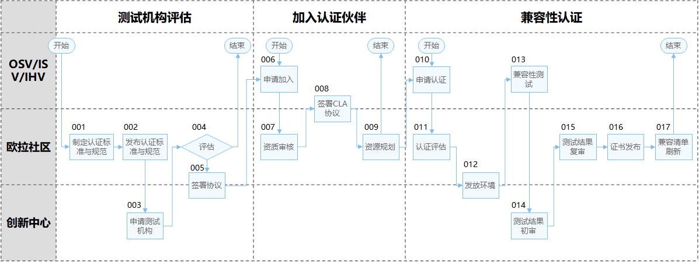
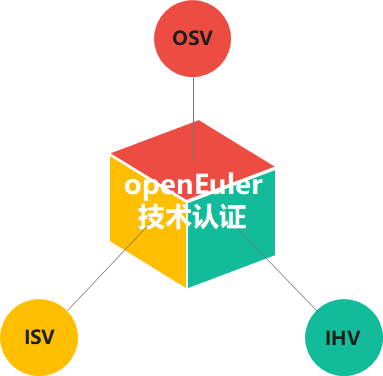

# technical-certification

## 介绍
存放openEuler认证相关的文档，包括认证标准、流程、指导性文档等

## 认证概述
欧拉认证：联合伙伴构建基于多样性算力的操作系统、数据库生态竞争力，打造可信、高质量的根技术生态圈。

## 认证流程

说明：

整体认证流程分成3个子流程模块：测试机构评估、认证伙伴管理、兼容性认证

- **测试机构评估**：由欧拉社区制定、发布认证标准和规范，并对创新中心是否有能力承担测试任务进行评估
- **认证伙伴管理**：针对OSV、ISV、IHV等认证对象伙伴，创建伙伴空间，承载认证流程
- **兼容性认证**：客户申请兼容认证、发放资源、认证测试、发布证书等

## 认证标准

**表1**  欧拉认证标准

| 认证伙伴 | 认证对象      | 证书类型       | 说明                                                         |
| -------- | ------------- | -------------- | ------------------------------------------------------------ |
| OSV      | OSV商用发行版 | 兼容性认证证书 | 确保根生态一致性和关键特性继承，引导成为OSV商业发行版伙伴    |
| ISV      | ISV商用软件   | 兼容性认证证书 | 认定ISV商业应用与欧拉社区发行版的兼容性，为使用社区发行版的伙伴提供商业选择 |
| IHV      | IHV整机和板卡 | 兼容性认证证书 | 证明硬件南向生态兼容，通过区域解决部件BCM问题，完成自动化测试平台 |

## 测试标准

**表2** 欧拉认证测试标准

| 认证对象      | 用例基线                  | 测试工具               | 说明 |
| :------------ | ------------------------- | ---------------------- | ---- |
| OSV商用发行版 | 未输出                    | /                      |      |
| ISV商用软件   | ISV商用软件测试用例集     | compassci              |      |
| IHV整机和板卡 | 整机用例集+板卡测试用例集 | compassci+oec-hardware |      |

## 参与贡献

1.  Fork 本仓库
2.  新建 Feat_xxx 分支
3.  提交代码
4.  新建 Pull Request

## 特技

1.  使用 Readme\_XXX.md 来支持不同的语言，例如 Readme\_en.md, Readme\_zh.md
2.  Gitee 官方博客 [blog.gitee.com](https://blog.gitee.com)
3.  你可以 [https://gitee.com/explore](https://gitee.com/explore) 这个地址来了解 Gitee 上的优秀开源项目
4.  [GVP](https://gitee.com/gvp) 全称是 Gitee 最有价值开源项目，是综合评定出的优秀开源项目
5.  Gitee 官方提供的使用手册 [https://gitee.com/help](https://gitee.com/help)
6.  Gitee 封面人物是一档用来展示 Gitee 会员风采的栏目 [https://gitee.com/gitee-stars/](https://gitee.com/gitee-stars/)
