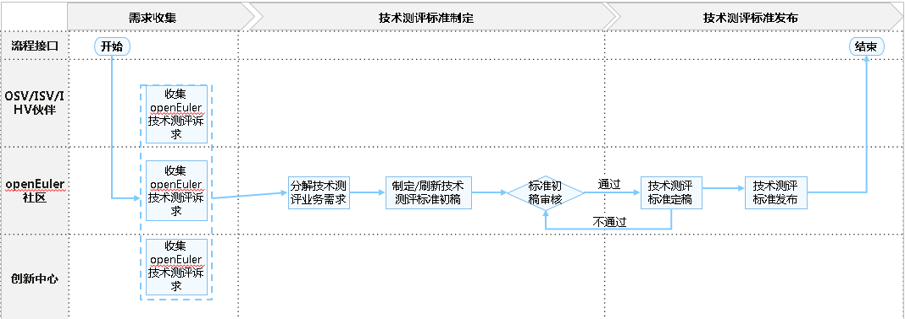
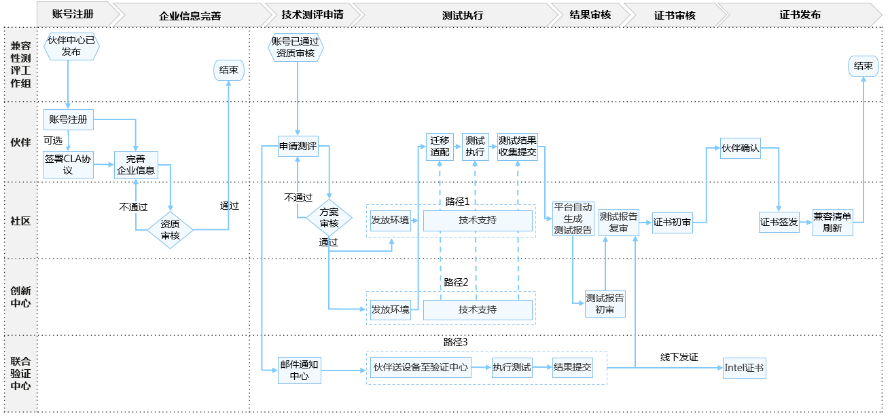

# technical-certification

## 介绍
存放openEuler技术测评相关的文档，包括技术测评标准、流程、指导性文档等

## 技术测评概述

openEuler技术测评：基于openEuler操作系统，含开源版本和商业版本，对软件伙伴产品及解决方案，完成的多样性算力平台下的兼容性验证测试，对硬件伙伴产品及解决方案，完成的适配验证测试。旨在联合伙伴构建基于多样性算力的操作系统生态竞争力，打造可信、高质量的根技术生态圈。

## openEuler技术测评标准发布流程

openEuler兼容性技术测评标准确认和发布的流程如下：

- 步骤1. 技术测评maintainer收集伙伴（OSV/IHV/ISV伙伴）、openEuler社区、创新中心对于openEuler技术测评的诉求。
- 步骤2. 分析收集的诉求，分解技术测评业务需求，并制定/刷新技术测评标准初稿。
- 步骤3. 在兼容性SIG组例会上发起议题，由兼容性SIG组全体成员审核并确认最终结果，形成技术测评标准终稿。
- 步骤4. 确认终稿后，在技术测评仓库和社区对应模块发布新标准。

## openEuler技术测评流程（适用于OSV/ISV/IHV伙伴的产品）

伙伴申请openEuler兼容性技术测评流程如下：

整个流程依托于[技术测评平台](https://certification.openeuler.org)进行，伙伴可直接前往平台进行测评申请。**详细的平台使用指引请见[技术测评平台用户指南](技术测评平台用户指南.md)**。如在测评过程中遇到任何问题，可联系[创新中心](https://gitee.com/openeuler/technical-certification/issues/I87HDL?from=project-issue)支持。

以下是测评流程步骤简介：

- 步骤1. 账号注册

  伙伴访问[技术测评平台](https://certification.openeuler.org)，账号注册登录后，签署CLA和兼容性协议。

- 步骤2. 完善企业信息

  签署完协议后，进入个人中心完善企业信息，包括企业营业执照，企业邮箱等等，提交后系统会自动进行审核，通过审核后才可进行方案申请。

- 步骤3. 申请技术测评

  完成协议签署和企业资质审核后，伙伴即可提交兼容性技术测评方案申请，申请时需提交信息包括：产品名称和版本、产品类型、产品介绍、所属行业、所有操作系统及版本、所用算力平台，确认信息无误后，即可提交方案，由openEuler社区（兼容性SIG组）进行审核。

- 步骤4. 执行测试

  通过审核后，如果伙伴缺少测试环境，可在创新中心申请测试资源，创新中心会根据伙伴方案的需求，发放对应的测试环境，之后协助伙伴进行迁移适配、按照[测试标准](#测试标准)测试执行和测试结果收集提交，并最终生成测试报告。

- 步骤5. 提交报告评审

  生成报告后，伙伴需将测试报告提交到技术测评平台对应的方案中，由创新中心和openEuler社区（兼容性SIG组）对测试报告进行评审。

- 步骤6. 证书确认

  通过评审后，即进入证书发放流程，此阶段openEuler社区会先对证书信息进行初审，通过后由伙伴对证书信息进行二次确认。

- 步骤7. 证书签发

  如社区和伙伴双方都对证书信息确认无误，社区进行证书的签发，并自动同步刷新到兼容性清单，完成整个流程。

## 技术测评标准

**表1**  openEuler技术测评标准

| 技术测评伙伴 | 技术测评对象      | 证书类型       | 说明                                                         |
| -------- | ------------- | -------------- | ------------------------------------------------------------ |
| OSV      | OSV商用发行版 | 兼容性技术测评证书 | 确保根生态一致性和关键特性继承，引导成为OSV商业发行版伙伴    |
| ISV      | ISV商用软件   | 兼容性技术测评证书 | 认定ISV商业应用与openEuler系发行版的兼容性，为使用openEuler系操作系统的伙伴提供商业选择 |
| IHV      | IHV整机和板卡 | 兼容性技术测评证书 | 证明硬件南向生态兼容，为使用openEuler系操作系统的客户提供硬件商业选择 |

## 测试标准

**表2** openEuler技术测评测试标准

| 技术测评对象      | 用例基线                  | 测试工具               | 测试交付件 |
| :------------ | ------------------------- | ---------------------- | ---- |
| OSV商用发行版 | [OSV商用发行版测试用例集](https://gitee.com/openeuler/oecp/blob/master/doc/) | [oecp](testing-tools/欧拉技术测评OSV操作系统测试工具oecp用户指南.md)       | 工具测试结果excel文件 + 社区测评结论邮件截图 |
| ISV商用软件   | [ISV商用软件测试用例集](testing-standard/欧拉技术测评兼容性测试用例（ISV商用软件）.md)     | [lkp-tests](testing-tools/欧拉技术测评ISV商用软件测试工具lkp-tests用户指南.md) + [x2openEuler](testing-tools/欧拉技术测评ISV商用软件扫描工具x2openEuler用户指南.md)             | [测试报告word文件](https://gitee.com/whatamaze/compatibility-test/tree/master/templates) |
| IHV整机和板卡 | [整机用例集+板卡测试用例集](testing-standard/欧拉技术测评兼容性测试用例（整机&板卡）.md) | [oec-hardware](testing-tools/欧拉技术测评IHV整机&板卡测试工具oec-hardware用户指南.md) | 工具pass/fail截图 + 测试日志 + [整机/板卡兼容性发布excel文件](https://gitee.com/openeuler/oec-hardware/tree/master/templates) |

## 参与贡献

1.  Fork 本仓库
2.  新建 Feat_xxx 分支
3.  提交代码
4.  新建 Pull Request