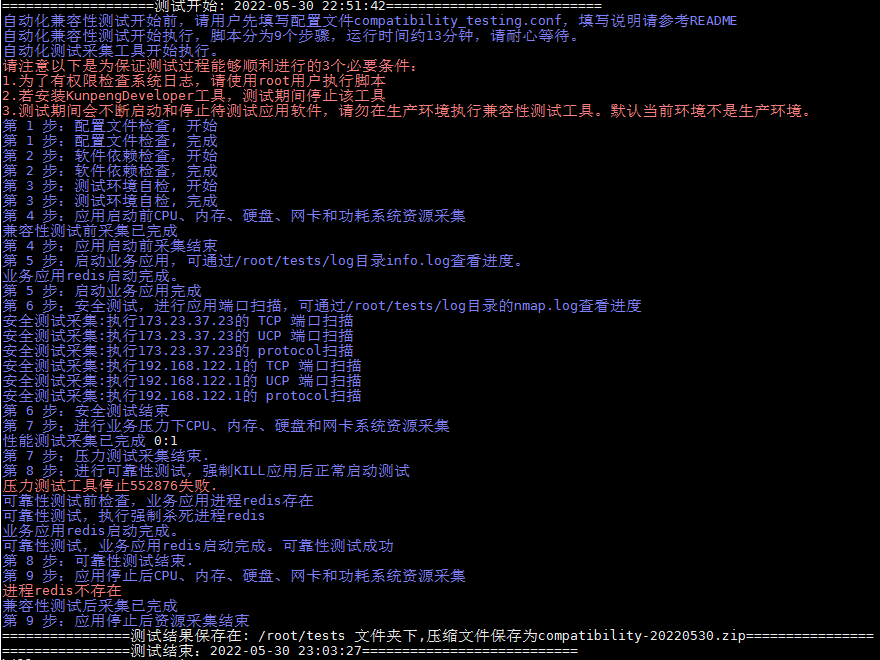

# 兼容性测试

## 概述
该测试套包含了鲲鹏与欧拉认证所需的测试项，这样在进行鲲鹏与欧拉的交叉认证时，只需将该工具执行一次就行。

## 前提条件
- 安装好lkp-tests测试工具，安装步骤如下：
    1. 工具源码
       ```shell
        git clone https://gitee.com/wu_fengguang/lkp-tests.git
       ```
    2. 修改ruby gems源
       ```shell
        cd lkp-tests
        sed -i "s/rubygems.org/gems.ruby-china.com/g" Gemfile
       ```
    3. 执行安装
       ```shell
        make install
       ```
    4. 写入环境变量
        将lkp-tests所在路径写入/etc/profile末尾，方便后续测试
       ```shell
        vi /etc/profile
        # 填写lkp-tests所在路径，例如"/home/lkp-tests"
        export LKP_PATH=""
       ```
    5. 使环境变量生效
       ```shell
        source /etc/profile
       ```

- 关闭防火墙(临时):  
       ```shell
        systemctl stop firewalld.service
       ```

- 停止业务软件(即环境空载)： 为避免后台存在其它进程正在运行影响后续测试结果可靠性。正式测试之前,停止所有伙伴业务应用软件进程(无需卸载),例如恢复到业务软件未安装之前的系统资源占用状态,以便监控测试过程中CPU，内存，硬盘，网卡等系统资源

## 操作步骤
1. 修改测试套的配置文件

```shell
vim compatibility-testing.conf
```
      
下面以redis为例填写配置文件如下：
```bash
# 待测试应用软件进程名称，多个应用名称以逗号隔开。
# 可通过ps或者docker top 命令CMD所在列查找后台进程名称。
application_names=redis
# 待测试应用软件启动命令，多个应用的启动命令以逗号隔开。
start_app_commands=systemctl start redis
# 待测试应用软件停止命令，多个应用的停止命令以逗号隔开。
stop_app_commands=systemctl stop redis
# 被测应用软件的压力测试工具启动命令。
start_performance_scripts=redis-benchmark

# 以下为C/C++编译的应用填写，请填写待测试应用二进制文件的绝对路径。
binary_file=
```

2. 测试套安装
    1. CentOS/中标麒麟/SUSE/openEuler: 使用root用户执行， sh install.sh
    2. Ubuntu/银河麒麟/UOS: 使用root用户执行，bash install.sh
    - 切换成root用户执行安装脚本
    ```shell
    sh install.sh
    ```

3. 安装lkp-tests的通用依赖(根据实际测试环境填写aarch64或x86_64)
```shell
export arch="aarch64"
```
       
4. 安装测试依赖
```shell
lkp split-job $LKP_PATH/jobs/compatibility-testing.yaml
```
执行成功后会在当前目录生成compatibility-testing-defaults.yaml文件,用于后续任务的调度
```shell
lkp install -f compatibility-testing-defaults.yaml
```

5. 执行测试
```shell
lkp run compatibility-testing-defaults.yaml
```

## 日志输出



## 日志步骤分析
步骤1：检查配置文件compatibility-testing的配置项是否填写,若没有填写,则测试终止


步骤2：确保安装好业务应用软件,测试工具及其依赖软件;若没有,则测试终止


步骤3： 从CPU、内存、硬盘和网卡四个角度检查利用率是否过高，如果过高,则测试终止


步骤4： 获取测试环境的硬件配置（"服务器型号","pci信息","CPU信息","硬盘分区","内核信息"）


步骤5： 启动业务应用进程和获取服务器进程的快照


步骤6： 对环境IP的端口进行安全测试扫描


步骤7： 压力测试采集和兼容性测试时进行CPU,内存，硬盘、网卡和功耗指标采集


步骤8： 进行可靠性测试,强制杀死应用后,正常启动应用


步骤9： 停止应用后,进行CPU、内存、硬盘、网卡和功耗系统资源采集

