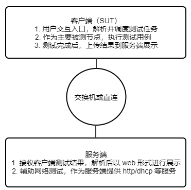
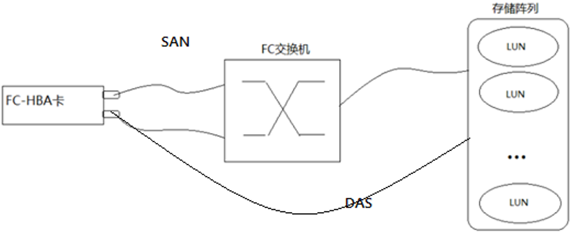

目 录

[1 范围 5](#范围)

[2 规范性引用文件 6](#规范性引用文件)

[3 术语和定义 7](#术语和定义)

[4 缩略语 8](#缩略语)

[5 测试对象 10](#测试对象)

[6 测试工具 11](#测试工具)

[7 测试指标 12](#测试指标)

[8 测试方案 13](#测试方案)

[8.1 总体要求 13](#总体要求)

[8.2 测试用例设计 13](#测试用例设计)

[8.2.1 整机测试用例集 13](#整机测试用例集)

[8.2.2 板卡测试用例集 14](#板卡测试用例集)

[8.2.2.1 NVMe测试 14](#nvme测试)

[8.2.2.2 网卡测试 15](#网卡测试)

[8.2.2.3 FC卡测试 15](#fc卡测试)

[8.2.2.4 GPU测试 16](#GPU测试)

[8.2.2.5 VGPU测试 16](#VGPU测试)

[8.2.2.6 密码卡测试 16](#密码卡测试)

[8.2.2.7 cdrom测试 16](#cdrom测试)

[9 测试用例 17](#测试用例)

[9.1 ACPI测试 17](#ACPI测试)

[9.2 时钟测试 18](#时钟测试)

[9.2.1 系统时间偏差测试 18](#系统时间偏差测试)

[9.2.2 RTC时钟稳定性测试 18](#rtc时钟稳定性测试)

[9.3 CPU测试 19](#CPU测试)

[9.3.1 CPU调频策略测试 18](#CPU调频策略测试)

[9.4 kdump测试 20](#kdump测试)

[9.4.1 kdump预留内存检查测试 20](#kdump预留内存检查测试)

[9.4.2 kdump可用性测试 20](#kdump可用性测试)

[9.4.3 vmcore分析测试 20](#vmcore分析)

[9.5 系统测试 21](#系统测试)

[9.5.1 基本信息检查 21](#基本信息检查)

[9.5.2 内核检查 21](#内核检查)

[9.5.3 selinux检查 22](#selinux检查)

[9.6 PERF测试 22](#PERF测试)

[9.6.1 系统事件捕获测试 22](#系统事件捕获测试)

[9.7 IPMI测试 23](#IPMI测试)

[9.8 watchdog测试 23](#watchdog测试)

[9.9 内存测试 24](#内存测试)

[9.9.1 内存读写测试 24](#内存读写测试)

[9.9.2 内存使用测试 24](#内存使用测试)

[9.9.3 内存hugetlb测试 25](#内存hugetlb测试)

[9.9.4 内存热插拔测试 25](#内存热插拔测试)

[9.10 磁盘测试 26](#磁盘测试)

[9.10.1 磁盘可用性测试 26](#磁盘可用性测试)

[9.10.2 读写测试 26](#读写测试)

[9.11 网卡测试 27](#网卡测试)

[9.11.1 普通网卡测试 27](#普通网卡测试)

[9.11.1.1 获取IP地址 27](#获取ip地址)

[9.11.1.2 网卡启停测试 27](#网卡启停测试)

[9.11.1.3 网卡连通性测试 28](#网卡连通性测试)

[9.11.1.5 文件上传下载测试 29](#文件上传下载测试)

[9.11.1.6 光模块测试 29](#光模块测试)

[9.11.2 IB卡测试 27](#IB卡测试)

[9.11.2.1 获取IP地址 27](#获取ip地址)

[9.11.2.2 IB卡端口状态查询 27](#IB卡端口状态查询)

[9.11.2.3 IB卡启停测试 27](#IB卡启停测试)

[9.11.2.4 IB卡连通性测试 28](#IB卡连通性测试)

[9.11.2.5 文件上传下载测试 29](#文件上传下载测试)

[9.11.2.6 光模块测试 29](#光模块测试)

[9.12 USB测试 30](#USB测试)

[9.13 RAID测试 30](#RAID测试)

[9.13.1 硬盘可用性测试 30](#硬盘可用性测试-1)

[9.13.2 读写测试 31](#读写测试-1)

[9.14 NVMe测试 31](#NVMe测试)

[9.14.1 nvme格式化测试 31](#nvme格式化测试)

[9.14.2 nvme读写测试 32](#nvme读写测试)

[9.14.3 nvme查询测试 32](#nvme查询测试)

[9.15 FC卡测试 39](#FC卡测试)

[9.15.1 lun测试 39](#lun测试)

[9.15.2 读写测试 39](#读写测试)

[9.16 GPU测试 41](#GPU测试)

[9.16.1 gpu-burn压力测试 41](#gpu-burn压力测试)

[9.16.2 cuda测试 41](#cuda测试)

[9.17 VGPU测试 41](#VGPU测试)

[9.17.1 vgpu资源使用测试 41](#vgpu资源使用测试)

[9.17.2 vgu虚拟机测试 41](#vgu虚拟机测试)

[9.18 密码卡测试 41](#密码卡测试)

[9.18.1 基本函数测试 41](#基本函数测试)

[9.18.2 RSA非对称密码运算函数测试 41](#RSA非对称密码运算函数测试)

[9.18.3 ECC非对称密码运算函数测试 41](#ECC非对称密码运算函数测试)

[9.18.4 对称密码运算函数测试 41](#对称密码运算函数测试)

[9.18.5 杂凑运算函数测试 41](#杂凑运算函数测试)

[9.18.6 用户文件操作函数测试 41](#用户文件操作函数测试)

[9.19 kabi测试 41](#kabi测试)

[9.20 cdrom测试 41](#cdrom测试)

[9.20.1 cdrom接口测试 41](#cdrom接口测试)

[9.20.2 刻录测试 41](#刻录测试)

[9.20.3 读写测试 41](#读写测试)

[10 测试报告 42](#测试报告)

[11 参考文献 43](#参考文献)

[A 修订记录 44](#修订记录)

# 范围

本文件描述了openEuler在整机和板卡场景的兼容性测试方法。

本文件适应于整机和板卡的兼容性测试和评估。

# 规范性引用文件

本文件没有规范性引用文件。

# 术语和定义

下列术语及定义适应于本文件。

1.  术语及定义

| 术语 | 定义 |
|--------------------|--------------------------------|
| 整机 | 是指终端设备成品，是最终用户完整体验/使用的产品包，由主机以及主机配套附件、包装材料构成。 |
| 板卡 | 板卡是一种印制电路板，简称PCB板，制作时带有插芯，可以插入计算机的主电路板（主板）的插槽中，用来控制硬件的运行，比如显示器、采集卡等设备，安装驱动程序后，即可实现相应的硬件功能。 |
| 兼容性测试  | 软件兼容性测试是指检查软件之间能否正确地进行交互和共享信息。随着用户对来自各种类型软件之间共享数据能力和充分利用空间同时执行多个程序能力的要求，测试软件之间能否协作变得越来越重要。软件兼容性测试工作的目标是保证软件或硬件按照用户期望的方式进行交互。  |
| 看门狗（watchdog） | 一种硬件装置，用于监视连续运行的系统是否正常，是通过与使用专用设备驱动程序的系统软件进行通信来完成。在程序运行后，看门狗开始自动计数，程序需要定期清零该计数器，即喂狗，若超时不喂狗，则计数器溢出从而引起计数器中断，造成系统复位。看门狗的作用就是防止程序发生死循环。 |

# 缩略语

下列缩略语适用于本文件。

1.  本文件涉及缩略语

| 缩略语 | 名称 | 定义 |
|--------|-----|------|
| CPU | 中央处理器（Central Processing Unit） | 中央处理器是计算机的主要设备之一，其功能是解释计算机指令以及处理计算机软件中的数据，与内部存储器、输入及输出设备成为现代电脑的三大部件。 |
| GPU | 图形处理器（Graphics Processing Unit） | 又称显示核心、视觉处理器、显示芯片，是一种专门在个人电脑、工作站、游戏机等设备上图像运算工作的微处理器，可用于桌面的图片渲染。 |
| ACPI | 高级配置与电源接口（Advanced Configuration and Power Interface） | 工业标准化规范，允许操作系统控制电源管理和PC配置以及服务器组件。 |
| HBA | 主机总线适配器（Host Bus Adapter） | 一个在服务器和存储装置间提供输入/输出（I/O）处理和物理连接的电路板和/或集成电路适配器。 |
| RDMA | 远程直接数据存取（Remote Direct Memory Access） | 使一台计算机可以直接将数据通过网络传送到另一台计算机内存中的功能。 |
| IB  | InfiniBand | 一种交换结构I/O技术，其设计思路是通过一套中心InfiniBand交换机在远程存贮器、网络以及服务器等设备之间建立一个单一的连接链路，并由中心InfiniBand交换机来指挥流量，它的结构设计得非常紧密，大大提高了系统的性能、可靠性和有效性，能缓解各硬件设备之间的数据流量拥塞。 |
| FC卡 | 光纤通道（Fibre Channel） | 通常指FC-HBA卡，就是将Fibre Channel的设备和IO总线连接起来的适配器，用于建立存储区域网的高速传输。 |
| lun | 逻辑单元号（Logical unit number） | 指的是一个用于SCSI总线的唯一的识别号，总线使它能区别其他设备（每个都是一个逻辑单元）。 |
| BIOS | 基本输入输出系统（Basic Input/Output System） | 存于计算机主板上的一种固件。包括基本输入输出控制程序、上电自检程序、系统启动自举程序、系统设置信息，为计算机提供底层的硬件设置和控制功能。 |
| NVMe | 非易失性高速传输总线（Non-Volatile Memory express） | 一种主机控制器接口。这种接口包含了一个寄存器接口和一个命令集。寄存器接口和命令集是专为基于PCIe的SSD设计的。 |
| RAID | 独立冗余磁盘阵列（Redundant Arrays of Independent Disks） | 一种把多块独立的硬盘（物理硬盘）按不同方式组合起来形成一个硬盘组（逻辑硬盘），从而提供比单个硬盘更高的存储性能和提供数据冗余的技术。 |
| kdump  | 基于kexec的宕机信息收集工具（Kernel Dump）  | kdump是ATAE的维护性工具，用于在系统停止响应时收集内存信息并自动重启操作系统。 |
| IPMI | 智能平台管理接口（Intelligent Platform Management Interface） | IPMI是为提高服务器的可用性指标而推出的智能化平台管理接口标准，可为服务器提供设备管理、传感器和事件管理、用户管理、风扇框和电源框管理、远程维护等功能。 |

# 测试对象

本文件的测试对象为整机或板卡。

测试环境示例参考下图。其中客户端用于执行测试用例，测试硬件；服务端用于接收客户端测试结果，生成测试报告，另外辅助客户端进行网卡测试。

1.  整机或板卡测试环境

# 测试工具

1.  整机或板卡兼容性测试工具

| 测试工具 | 用途 |
|---------|------|
| oec-hardware | 用于验证OS厂商与硬件兼容性的测试套件，整合系统、内存、磁盘、网卡、USB、GPU等测试工具。 |

# 测试指标

本工具主要进行兼容性测试，不涉及性能测试，无性能指标。

# 测试方案

[8.1 总体要求](#总体要求)

[8.2 测试用例设计](#测试用例设计)

## 总体要求

整机或板卡兼容性测试用例运行达到预期结果，无报错。

## 测试用例设计

### 整机测试用例集

1.  整机兼容性测试用例集

| **编号** | **用例分类** | **用例名称** | **测试工具** | **说明** |
|----------|-------------|--------------|-------------|----------|
| 1 | ACPI测试  | ACPI测试 | oec-hardware |  |
| 2 | 时钟测试  | 系统时间偏差测试  | oec-hardware | |
| 3 | | RTC时钟稳定性测试 | oec-hardware |  |
| 4 | CPU测试 | CPU调频策略测试 | oec-hardware | 需预设BIOS支持调频 |
| 5 | kdump测试 | kdump预留内存检查测试 | oec-hardware |  |
| 6 | | kdump可用性测试 | oec-hardware |  |
| 7 | | vmcore分析测试 | oec-hardware | 需重启操作系统 |
| 8 | PERF测试 | 系统事件捕获测试 | oec-hardware | 调用perf工具收集采样 |
| 9 | 系统测试 | 基本信息检查 | oec-hardware |  |
| 10 | | 内核检查 | oec-hardware |  |
| 11 | | selinux检查 | oec-hardware |  |
| 12 | IPMI测试 | IPMI测试 | oec-hardware | 调用ipmitool进行查询 |
| 13 | watchdog测试 | watchdog测试 | oec-hardware |  |
| 14 | 内存测试 | 内存读写测试 | oec-hardware | 调用memtester测试 |
| 15 | | 内存占用测试 | oec-hardware |  |
| 16 | | 内存大页测试 | oec-hardware |  |
| 17 | | 内存热插拔测试 | oec-hardware | 该用例实现待完善  |
| 18 | 磁盘测试 | 磁盘可用性测试 | oec-hardware |  |
| 19 | | 磁盘读写测试 | oec-hardware  |  |
| 20 | 网卡测试 | 获取IP地址 | oec-hardware |  |
| 21 | | 网卡启停测试 | oec-hardware |  |
| 22 | | 网卡连通性测试 | oec-hardware |  |
| 23 | | 延迟和带宽测试 | oec-hardware |  |
| 24 | | 文件上传下载测试  | oec-hardware |  |
| 25 | | 光模块测试  | oec-hardware |  |
| 26 | USB测试 | USB插拔测试 | oec-hardware | 需要手动执行拔插  |
| 27 | RAID测试 | 硬盘可用性测试 | oec-hardware | |
| 28 | | 读写测试 | oec-hardware |  |
| 29 | kabi测试 | 内核kabi测试 | oec-hardware | |

### 板卡测试用例集

#### NVMe测试

1.  NVMe卡或NVMe盘测试用例集

| **编号** | **用例分类** | **用例名称** | **测试工具** | **说明** |
|----------|-------------|-------------|--------------|----------|
| / | 表8-1 | 板卡测试用例集 | | |
| 30 | NVMe测试  | nvme格式化测试  | oec-hardware | |
| 31 | | nvme读写测试  | oec-hardware | |
| 32 | | nvme查询测试 | oec-hardware | |

#### 网卡测试

1.  网卡测试用例集

| **编号** | **用例分类** | **用例名称** | **测试工具** | **说明** |
|----------|-------------|--------------|-------------|----------|
| / | 表8-2 | 板卡测试用例集 | | |
| 33 | 普通网卡测试 | 获取IP地址 | oec-hardware | |
| 34 | | 网卡启停测试  | oec-hardware | |
| 35 | | 网卡连通性测试 | oec-hardware | |
| 36 | | 延迟和带宽测试 | oec-hardware | |
| 37 | | 文件上传下载测试 | oec-hardware | |
| 38 | | 光模块测试 | oec-hardware | |
| 39 | IB卡测试 | 获取IP地址 | oec-hardware | |
| 40 | | IB卡设备端口状态查询  | oec-hardware | |
| 41 | | IB卡启停测试  | oec-hardware | |
| 42 | | IB卡连通性测试 | oec-hardware | |
| 43 | | 文件上传下载测试 | oec-hardware | |
| 44 | | 光模块测试 | oec-hardware | |

#### FC卡测试

1.  FC卡测试用例集

| **编号** | **用例分类** | **用例名称** | **测试工具** | **说明** |
|----------|-------------|-------------|--------------|----------|
| / | 表8-3 | 板卡测试用例集 | | |
| 45 | FC卡测试  | lun测试 | oec-hardware | |
| 46 | | 读写测试 | oec-hardware | |

#### GPU测试

1.  GPU测试用例集

| **编号** | **用例分类** | **用例名称** | **测试工具** | **说明** |
|----------|-------------|-------------|--------------|----------|
| / | 表8-4 | 板卡测试用例集 | | |
| 47 | GPU测试 | gpu-burn压力测试 | oec-hardware | 测试前，必须先安装相关gpu驱动，配置环境 |
| 48 | | cuda测试 | oec-hardware | |

#### VGPU测试

1.  VGPU测试用例集

| **编号** | **用例分类** | **用例名称** | **测试工具** | **说明** |
|----------|-------------|-------------|--------------|----------|
| / | 表8-5 | 板卡测试用例集 | | |
| 49 | VGPU测试  | vgpu资源使用测试 | oec-hardware | 测试前，必须先安装相关vgpu驱动，配置环境 |
| 50 | | vgpu虚拟机测试 | oec-hardware | |

#### 密码卡测试

1.  密码卡测试用例集

| **编号** | **用例分类** | **用例名称** | **测试工具** | **说明** |
|----------|-------------|-------------|--------------|----------|
| / | 表8-6 | 板卡测试用例集 | | |
| 51 | 密码卡测试 | 基本函数测试  | oec-hardware | |
| 52 | | RSA非对称密码运算函数测试 | oec-hardware | |
| 53 | | ECC非对称密码运算函数测试 | oec-hardware | |
| 54 | | 对称密码运算函数测试 | oec-hardware | |
| 55 | | 杂凑运算函数测试 | oec-hardware | |

#### cdrom测试

1.  cdrom测试用例集

| **编号** | **用例分类** | **用例名称** | **测试工具** | **说明** |
|----------|-------------|-------------|--------------|----------|
| / | 表8-7 | 板卡测试用例集 | | |
| 56 | cdrom测试 | cdrom接口测试  | oec-hardware | |
| 57 | | 刻录测试 | oec-hardware | |
| 58 | | 读写测试 | oec-hardware | |

#### kabi测试

1.  kabi测试用例集

| **编号** | **用例分类** | **用例名称** | **测试工具** | **说明** |
|----------|-------------|-------------|--------------|----------|
| / | 表8-8 | 板卡测试用例集 | | |
| 59 | kabi测试 | 内核kabi接口测试  | oec-hardware | kabi为每个板卡测试的必测项 |

# 测试用例

[9.1 ACPI测试](#acpi测试)

[9.2 时钟测试](#时钟测试)

[9.3 CPU测试](#CPU测试)

[9.4 kdump测试](#kdump测试)

[9.5 系统测试](#系统测试)

[9.6 PERF测试](#PERF测试)

[9.7 IPMI测试](#ipmi测试)

[9.8 watchdog测试](#watchdog测试)

[9.9 内存测试](#内存测试)

[9.10 磁盘测试](#磁盘测试)

[9.11 网卡测试](#网卡测试-1)

[9.12 USB测试](#USB测试)

[9.13 RAID测试](#RAID测试)

[9.14 NVMe测试](#nvme测试-1)

[9.15 FC卡测试](#fc卡测试-1)

[9.16 GPU测试](#gpu测试-1)

[9.17 VGPU测试](#vgpu测试)

[9.18 密码卡测试](#密码卡测试-1)

[9.19 kabi测试](#kabi测试)

[9.20 cdrom测试](#cdrom测试-1)

## ACPI测试

| **用例名称** | ACPI测试 |
|--------------|---------|
| **用例编号** | ACPI |
| **测试目的** | 提取ACPI表，查看电源配置是否合理 |
| **预置条件** | 已安装openEuler操作系统。 已部署oec-hardware兼容测试工具套件。 已安装acpica-tools依赖。 |
| **测试步骤** | 使用acpikdump读取ACPI表(DSDT、RSDP、SDTH、RSDT、FADT) |
| **预期结果** | 读取acpi表成功  |
| **备注**  |  |

## 时钟测试

### 系统时间偏差测试

| **用例名称** | 系统时间偏差测试 |
|-------------|-----------------|
| **用例编号** | ClockSystemTime |
| **测试目的** | 测试系统时间偏差 |
| **预置条件** | 已安装openEuler操作系统。 已部署oec-hardware兼容测试工具套件。 |
| **测试步骤** | 查询当前系统时间。 等待1分钟。 查询当前系统时间。 确认系统时间是否有偏差。 |
| **预期结果** | 系统时间没有偏差。 |
| **备注**  |  |

### RTC时钟稳定性测试

| **用例名称** | RTC时钟稳定性测试 |
|-------------|------------------|
| **用例编号** | ClockRTC |
| **测试目的** | 测试RTC硬件时钟稳定性 |
| **预置条件** | 已安装openEuler操作系统。 已部署oec-hardware兼容测试工具套件。 |
| **测试步骤** | 查询RTC时钟。 等待2分钟。 查询RTC时钟。 确认RTC时钟是否有偏差。  |
| **预期结果** | RTC时钟没有偏差。 |
| **备注**  |  |

## CPU测试

| **用例名称** | CPU调频策略测试 |
|-------------|----------------|
| **用例编号** | CPUFreq |
| **测试目的** | 测试 cpu 在不同调频策略下运行频率是否预期 测试 cpu 在不同频率下完全同规格计算量所需时间是否与频率值吻合  |
| **预置条件** | 已安装openEuler操作系统。 已部署oec-hardware兼容测试工具套件。 |
| **测试步骤** | 默认为userspace模式，分别设置最大频率和最小频率，运行负载程序，执行时间和频率值相符合。 设置ondemand模式成功，运行负载程序，测试频率不等于最大值，负载程序完成后，测试频率小于等于最大值。 设置conservative模式成功，运行负载程序，等待1S，检查CPU频率是否处于最小值和最大值之间的某个随机值，负载程序运行完成后，打印执行时间和频率。 设置powersave模式成功，检查CPU频率是否为最小值，运行负载程序完成后，打印执行时间和频率。 设置performance模式成功，检查CPU频率是否为最大值，运行负载程序完成后，打印执行时间和频率。 |
| **预期结果** | cpu在不同调频策略下运行频率符合预期。 cpu在不同频率下同规格计算量所需时间跟频率值吻合。 |
| **备注**  |  |

## kdump测试

### kdump预留内存检查测试

| **用例名称** | kdump预留内存检查测试 |
|-------------|--------------|
| **用例编号** | kdumpUse |
| **测试目的** | 触发kdump并解析vmcore文件 |
| **预置条件** | 已安装openEuler操作系统。 已部署oec-hardware兼容测试工具套件 |
| **测试步骤** | 1.从cmdline文件获取crashkernel参数值。 2.触发kdump。 3. 重启系统后解析vmcore文件。  |
| **预期结果** | 1.crashkernel值获取成功。 2.kdump触发成功。 3.vmcore文件解析成功。 |
| **备注**  | |

### kdump可用性测试

| **用例名称** | kdump可用性测试 |
|-------------|----------------|
| **用例编号** | kdumpUse  |
| **测试目的** | 系统可以正常触发kdump |
| **预置条件** | 已安装openEuler操作系统。 已部署oec-hardware兼容测试工具套件。 安装crash, kernel-debuginfo, kexec-tools依赖。 |
| **测试步骤** | 触发系统异常，重启系统。 |
| **预期结果** | 系统重启，生成vmcome文件。 |
| **备注**  | |

### vmcore分析测试

| **用例名称** | vmcore分析测试 |
|-------------|----------------|
| **用例编号** | kdumpCrash |
| **测试目的** | 通过crash分析kdump生成的vmcore文件 |
| **预置条件** | 已安装openEuler操作系统。 已部署oec-hardware兼容测试工具套件。 安装crash, kernel-debuginfo, kexec-tools依赖。 |
| **测试步骤** | 使用crash工具分析vmcore |
| **预期结果** | 分析成功，打印分析日志。|
| **备注**  | |

## 系统测试

### 基本信息检查

| **用例名称** | system基本信息检查测试 |
|-------------|-----------------------|
| **用例编号** | SystemInfoCheck  |
| **测试目的** | 查询硬件型号信息，系统版本信息，系统内核模块信息 |
| **预置条件** | 已安装openEuler操作系统。 已部署oec-hardware兼容测试工具套件。 |
| **测试步骤** | 使用dmidecode工具读取硬件信息，uname -a命令查询系统信息，lsmod命令查询已载入系统的模块。 |
| **预期结果** | 能够正常获取硬件整机、内存dimm条相关信息。 |
| **备注**  |  |

### 内核检查

| **用例名称** | system内核检查测试 |
|-------------|-------------------|
| **用例编号** | SystemKernel |
| **测试目的** | system内核检查 |
| **预置条件** | 已安装openEuler操作系统。 已部署oec-hardware兼容测试工具套件。|
| **测试步骤** | 检查是否为debug kernel。 检查os版本和kerner版本是否匹配。 检查内核是否被污染或者内核rpm包是否被修改。 查看内核启动参数。 |
| **预期结果** | 1.系统不是debug kernel。 2.os版本和kerner版本匹配。 3.内核没有被污染，内核rpm没有被修改。 4.查看内核启动参数成功。 |
| **备注**  | |

### selinux检查

| **用例名称** | selinux检查测试 |
|-------------|-----------------|
| **用例编号** | SystemSelinux |
| **测试目的** | 检测selinux可用性 |
| **预置条件** | 已安装openEuler操作系统。 已部署oec-hardware兼容测试工具套件。 |
| **测试步骤** | 检查selinux状态为enable。 检查selinux安全策略为enforcing。 |
| **预期结果** | 1.selinux已启用。 2.selinux安全策略为enforcing。 |
| **备注**  |  |

## PERF测试

| **用例名称** | 系统事件捕获测试 |
|-------------|----------|
| **用例编号** | 系统事件捕获测试 |
| **测试目的** | 捕获系统事件信息 |
| **预置条件** | 已安装openEuler操作系统。 已部署oec-hardware兼容测试工具套件。 |
| **测试步骤** | 收集cycle采样信息，并记录到数据文件中。 列出数据文件中全部性能事件。 读取perf record建立的数据文件，并显示热点分析结果。 |
| **预期结果** | 1.收集cycle信息成功。 2.成功列出数据文件中全部性能事件。 3.热点分析成功。  |
| **备注**  | |

## IPMI测试

| **用例名称** | ipmi测试 |
|-------------|----------|
| **用例编号** | ipmi测试 |
| **测试目的** | 查询ipmi信息 |
| **预置条件** | 已安装openEuler操作系统。 已部署oec-hardware兼容测试工具套件。 |
| **测试步骤** | 1.启动ipmi服务。 2.查看内建的RFU信息。 3.查看sensor信息。  |
| **预期结果** | 1.服务启动成功。 2.内建的RFU信息查看成功。 3.sensor信息查看成功。 |
| **备注**  | |

## watchdog测试

| **用例名称** | watchdog测试 |
|-------------|--------------|
| **用例编号** | watchdog测试 |
| **测试目的** | 触发watchdog，测试系统是否可以正常复位 |
| **预置条件** | 已安装openEuler操作系统。 已部署oec-hardware兼容测试工具套件。 |
| **测试步骤** | 1.设置喂狗间隔时长。 2.触发watchdog。 |
| **预期结果** | 1.喂狗间隔时长设置成功。 2.系统重启成功。 |
| **备注**  |  |

## 内存测试

### 内存读写测试

| **用例名称** | 内存读写测试 |
|-------------|--------------|
| **用例编号** | MemoryRW |
| **测试目的** | 测试内存读写是否成功 |
| **预置条件** | 已安装openEuler操作系统。已部署oec-hardware测试工具。 |
| **测试步骤** | 使用memtester进行内存读写测试  |
| **预期结果** | 内存读写成功 |
| **备注**  | |

### 内存使用测试

| **用例名称** | 内存使用测试 |
|-------------|-------------|
| **用例编号** | MemoryUsed |
| **测试目的** | eatmemory测试 |
| **预置条件** | 已安装openEuler操作系统。已部署oec-hardware测试工具。 |
| **测试步骤** | 1.检查eatmemory条件。 2.测试eatmemory。  |
| **预期结果** | 1.系统内存大于0，swap内存大于512Mb。 2.eatmemory测试成功。 |
| **备注**  | |

### 内存hugetlb测试

| **用例名称** | 内存Hugetlb测试 |
|-------------|-----------------|
| **用例编号** | MemoryHugetlb |
| **测试目的** | 大页内存测试 |
| **预置条件** | 已安装openEuler操作系统。已部署oec-hardware测试工具。 |
| **测试步骤** | 1.查询大页内存，根据查询结果分配大页内存。 2.测试大页内存功能。 |
| **预期结果** | 1.大页内存分配成功。 2.大页内存测试成功。 |
| **备注**  | |

### 内存热插拔测试

| **用例名称** | 内存热插拔测试 |
|-------------|---------------|
| **用例编号** | MemoryHotSwap |
| **测试目的** | 测试内存热插拔 |
| **预置条件** | 已安装openEuler操作系统。已部署oec-hardware测试工具。 |
| **测试步骤** | 1.检查是否支持内存热插拔测试。 2.获取可移除的内存块。 3.使某块可移除内存块在线，读取系统内存。 4.使该块可移除内存离线，读取系统内存。 5.使该块可移除内存在线，读取系统内存。 6.所有可移除内存循环3\~5步骤 |
| **预期结果** | 1.支持继续，否则测试完成。 2.获取可移除内存块成功。 3.内存块在线，读取系统内存成功mem1。 4.内存块离线，读取系统内存成功mem2，mem2大于mem1。 5.内存块在线，读完系统内存成功mem3，mem3等于mem1。 |
| **备注**  | 该用例实现待完善，当前内存测试不包含热插拔测试。 |

## 磁盘测试

### 磁盘可用性测试

| **用例名称** | 磁盘可用性测试 |
|-------------|-------------|
| **用例编号** | DiskPartition |
| **测试目的** | 磁盘/磁盘分区可用性 |
| **预置条件** | 已安装openEuler操作系统。已部署oec-hardware测试工具。 |
| **测试步骤** | 测试指定磁盘/磁盘分区是否为空闲状态。 |
| **预期结果** | 指定磁盘/磁盘分区为空闲状态，可进行测试。 |
| **备注**  | 测试前需要在工具配置文件中写明测试磁盘或磁盘分区名称 |

### 读写测试

| **用例名称** | 磁盘读写测试 |
|-------------|-------------|
| **用例编号** | DiskRW |
| **测试目的** | 测试裸盘进行顺序/随机读写 |
| **预置条件** | 已安装openEuler操作系统。 已部署oec-hardware兼容测试工具套件。 已获取空闲磁盘。 |
| **测试步骤** | 1.对裸盘进行顺序读写测试 2.对裸盘进行随机读写测试 3.对文件系统进行顺序读写测试 4.对文件系统进行随机读写测试 |
| **预期结果** | 1.裸盘顺序读写成功 2.裸盘随机读写成功 3.文件系统顺序读写成功 4.文件系统随机读写成功  |
| **备注**  | 测试前需要在工具配置文件中写明测试磁盘或磁盘分区名称 |

## 网卡测试

### 普通网卡测试

#### 获取IP地址

| **用例名称** | 获取IP地址测试 |
|-------------|---------------|
| **用例编号** | EthernetGetIP |
| **测试目的** | 获取C/S的IP地址 |
| **预置条件** | 已安装openEuler操作系统。 已部署oec-hardware兼容测试工具套件。 |
| **测试步骤** | 获取C/S的ip地址  |
| **预期结果** | 获取C/S的ip地址成功 |
| **备注**  | 客户端和服务端的测试网卡需要直连。如果网卡没有配置IP，工具会自动分配同网段IP；如果网卡已配置同网段IP，测试前需要在工具配置文件中写明服务端ip。 |

#### 网卡启停测试

| **用例名称** | 网卡启停测试 |
|-------------|-------------|
| **用例编号** | EthernetNIC |
| **测试目的** | 网卡是否可以正常启动、关闭，获取网卡速率 |
| **预置条件** | 已安装openEuler操作系统。 已部署oec-hardware兼容测试工具套件。 |
| **测试步骤** | 1.启动和关闭网卡。 2.获取网卡速率。 |
| **预期结果** | 1.网卡正常启停。 2.网卡速率获取成功。 |
| **备注**  | 客户端和服务端的测试网卡需要直连。如果网卡没有配置IP，工具会自动分配同网段IP；如果网卡已配置同网段IP，测试前需要在工具配置文件中写明服务端ip。 |

#### 网卡连通性测试

| **用例名称** | 网卡连通性测试 |
|--------------|--------------|
| **用例编号** | EthernetPing |
| **测试目的** | 对端网卡连通性测试 |
| **预置条件** | 已安装openEuler操作系统。 已部署oec-hardware兼容测试工具套件。 |
| **测试步骤** | 执行ping命令。 获取结果分析。  |
| **预期结果** | 1.可以ping通服务端。 2.没有丢包。 |
| **备注**  | 客户端和服务端的测试网卡需要直连。如果网卡没有配置IP，工具会自动分配同网段IP；如果网卡已配置同网段IP，测试前需要在工具配置文件中写明服务端ip。 |

#### 延迟和带宽测试

| **用例名称** | 网络延迟和带宽测试 |
|-------------|--------------------------|
| **用例编号** | EthernetPerf  |
| **测试目的** | 测试C/S之间的网络延迟和Server的带宽 |
| **预置条件** | 已安装openEuler操作系统。 已部署oec-hardware兼容测试工具套件。 |
| **测试步骤** | 1.开启服务端qperf服务。 2. 测试UDP流延迟。 3. 测试TCP流延迟。 4.测试TCP流带宽。 5.关闭服务端qperf服务。  |
| **预期结果** | 1.服务端qperf服务开启成功。 2.UDP流延迟测试成功。 3.TCP流延迟测试成功。 4.测试带宽大于最大带宽的80%。 5.服务端qperf关闭成功。 |
| **备注**  | 客户端和服务端的测试网卡需要直连。如果网卡没有配置IP，工具会自动分配同网段IP；如果网卡已配置同网段IP，测试前需要在工具配置文件中写明服务端ip。 |

#### 文件上传下载测试

| **用例名称** | 文件上传下载测试 |
|-------------|-----------------|
| **用例编号** | EthernetFTP |
| **测试目的** | 测试C/S之间文件的上传和下载 |
| **预置条件** | 已安装openEuler操作系统。 已部署oec-hardware兼容测试工具套件。 |
| **测试步骤** | 1.创建上传文件。 2.上传测试文件。 3.下载测试文件。 |
| **预期结果** | 1.上传文件成功。 2.文件上传到服务端，并计算出上传速率。 3.文件从服务端下载，并计算出下载速率。 |
| **备注**  | 客户端和服务端的测试网卡需要直连。如果网卡没有配置IP，工具会自动分配同网段IP；如果网卡已配置同网段IP，测试前需要在工具配置文件中写明服务端ip。 |

#### 光模块测试

| **用例名称** | 光模块测试 |
|-------------|-----------------|
| **用例编号** | 光模块测试 |
| **测试目的** | 光口网卡光模块测试 |
| **预置条件** | 已安装openEuler操作系统。 已部署oec-hardware兼容测试工具套件。 |
| **测试步骤** | 1.判断网口是否为光口；2.检测光模块速率；3.查询光模块信息； |
| **预期结果** | 1.电口网卡跳过该测试，光口继续测试； 2.1GE速率的光模块跳过该测试，1GE以上光模块继续测试； 3.查询光模块信息成功。 |
| **备注**  | 客户端和服务端的测试网卡需要直连。如果网卡没有配置IP，工具会自动分配同网段IP；如果网卡已配置同网段IP，测试前需要在工具配置文件中写明服务端ip。 |

### IB卡测试

#### 获取IP地址测试

| **用例名称** | 获取IP地址测试 |
|-------------|---------------|
| **用例编号** | EthernetGetIP |
| **测试目的** | 获取C/S的IP地址  |
| **预置条件** | 已安装openEuler操作系统。 已部署oec-hardware兼容测试工具套件。 |
| **测试步骤** | 获取C/S的ip地址 |
| **预期结果** | 获取C/S的ip地址成功 |
| **备注**  | 客户端和服务端的测试网卡需要直连。如果网卡没有配置IP，工具会自动分配同网段IP；如果网卡已配置同网段IP，测试前需要在工具配置文件中写明服务端ip。 |

#### IB卡端口状态查询

| **用例名称** | IB卡端口状态查询 |
|-------------|-----------------|
| **用例编号** | IBstatus |
| **测试目的** | IB卡端口信息查询，端口状态查询  |
| **预置条件** | 已安装openEuler操作系统。 已部署oec-hardware兼容测试工具套件。 |
| **测试步骤** | 1.启动opensm服务。 2.加载ib_umad模块。 3.查看IB卡端口状态。 |
| **预期结果** | 1.网卡正常启停。 2.ib_uma模块加载成功。 3，BI卡端口状态信息获取成功。|
| **备注**  | 客户端和服务端的测试网卡需要直连。如果网卡没有配置IP，工具会自动分配同网段IP；如果网卡已配置同网段IP，测试前需要在工具配置文件中写明服务端ip。 |

#### IB卡启停测试

| **用例名称** | IB卡启停测试 |
|-------------|-------------|
| **用例编号** | IBupdown |
| **测试目的** | IB卡是否可以正常启动、关闭，获取网卡速率 |
| **预置条件** | 已安装openEuler操作系统。 已部署oec-hardware兼容测试工具套件。 |
| **测试步骤** | 1.启动和关闭IB卡。 2.获取到IB卡速率。 |
| **预期结果** | 1.IB卡正常启停。 3.IB卡速率获取成功。 |
| **备注**  | 客户端和服务端的测试网卡需要直连。如果网卡没有配置IP，工具会自动分配同网段IP；如果网卡已配置同网段IP，测试前需要在工具配置文件中写明服务端ip。 |

#### IB卡连通性测试

| **用例名称** | IB卡连通性测试 |
|-------------|----------------|
| **用例编号** | IBing |
| **测试目的** | 对端IB卡连通性测试 |
| **预置条件** | 已安装openEuler操作系统。 已部署oec-hardware兼容测试工具套件。 |
| **测试步骤** | 1.执行ping命令。 2.获取结果分析。 |
| **预期结果** | 1.可以ping通服务端。 2.没有丢包。 |
| **备注**  | 客户端和服务端的测试网卡需要直连。如果网卡没有配置IP，工具会自动分配同网段IP；如果网卡已配置同网段IP，测试前需要在工具配置文件中写明服务端ip。 |

#### 文件上传下载测试

| **用例名称** | 文件上传下载测试 |
|-------------|-----------------|
| **用例编号** | EthernetFTP |
| **测试目的** | 测试C/S之间文件的上传和下载 |
| **预置条件** | 已安装openEuler操作系统。 已部署oec-hardware兼容测试工具套件。 |
| **测试步骤** | 1.启动服务端。 2.创建上传文件。 3.文件上传服务端。 4.使用ib_read_bw工具测试读速率 5.使用ib_write_bw工具测试写速率 6.使用ib_send_bw工具测试速率 |
| **预期结果** | 1.服务启动成功 2.创建文件成功 3.文件上传成功 4.读速率大于实际速度\*0.5 5.写速率大于实际速度\*0.5 6.实际速率大于实际速度\*0.5 |
| **备注**  | 客户端和服务端的测试网卡需要直连。如果网卡没有配置IP，工具会自动分配同网段IP；如果网卡已配置同网段IP，测试前需要在工具配置文件中写明服务端ip。 |

#### 光模块测试

| **用例名称** | 光模块测试 |
|-------------|-----------------|
| **用例编号** | 光模块测试 |
| **测试目的** | 光口网卡光模块测试 |
| **预置条件** | 已安装openEuler操作系统。 已部署oec-hardware兼容测试工具套件。 |
| **测试步骤** | 1.判断网口是否为光口；2.检测光模块速率；3.查询光模块信息； |
| **预期结果** | 1.电口网卡跳过该测试，光口继续测试； 2.1GE速率的光模块跳过该测试，1GE以上光模块继续测试； 3.查询光模块信息成功。 |
| **备注**  | 客户端和服务端的测试网卡需要直连。如果网卡没有配置IP，工具会自动分配同网段IP；如果网卡已配置同网段IP，测试前需要在工具配置文件中写明服务端ip。 |

## USB测试

| **用例名称** | USB插拔测试 |
|-------------|-------------|
| **用例编号** | USBSwap |
| **测试目的** | USB端口检查 |
| **预置条件** | 已安装openEuler操作系统。 已部署oec-hardware兼容测试工具套件。 |
| **测试步骤** | 1.插入usb设备，检测usb接口是否有设备插入。 2.拔掉usb设备，检测usb接口是否有设备被拔掉  |
| **预期结果** | 1.检测到有新设备插入。 2.检测到有设备拔掉 |
| **备注**  | USB设备类型无要求。 |

## RAID测试

### 硬盘可用性测试

| **用例名称** | 硬盘可用性测试 |
|-------------|----------|
| **用例编号** | RaidPartition |
| **测试目的** | RIAD下挂载的硬盘可用性测试 |
| **预置条件** | 已安装openEuler操作系统。 已部署oec-hardware兼容测试工具套件。 已配置RAID，RAID下存在可用硬盘。 |
| **测试步骤** | 测试指定硬盘是否可用。 |
| **预期结果** | 硬盘为空闲状态，可进行测试。 |
| **备注**  | 测试前需要在工具配置文件中写明raid测试的硬盘名称。 |

### 读写测试

| **用例名称** | 读写测试 |
|-------------|----------|
| **用例编号** | RaidRW |
| **测试目的** | 裸盘顺序/随机读写测试 |
| **预置条件** | 已安装openEuler操作系统。 已部署oec-hardware兼容测试工具套件。 已配置RAID。 |
| **测试步骤** | 1.对裸盘进行顺序读写测试 2.对裸盘进行随机读写测试 3.对文件系统进行顺序读写测试 4.对文件系统进行随机读写测试 |
| **预期结果** | 1.裸盘顺序读写成功 2.裸盘随机读写成功 3.文件系统顺序读写成功 4.文件系统随机读写成功  |
| **备注**  | 测试前需要在工具配置文件中写明raid测试的硬盘名称。 |

## NVMe测试

### nvme格式化测试

| **用例名称** | nvme格式化测试 |
|-------------|---------------|
| **用例编号** | NVMeFormat  |
| **测试目的** | nvme格式化测试 |
| **预置条件** | 已安装openEuler操作系统。 已部署oec-hardware兼容测试工具套件 |
| **测试步骤** | 1.检查磁盘是否挂载别的文件系统。 2.格式化磁盘。 |
| **预期结果** | 1.未挂载别的文件系统测试继续，否则测试失败。 2.格式化磁盘成功，否则测试失败。 |
| **备注**  | |

### nvme读写测试

| **用例名称** | nvme读写测试 |
|-------------|------------|
| **用例编号** | NVMeRead  |
| **测试目的** | nvme读写测试 |
| **预置条件** | 已安装openEuler操作系统。 已部署oec-hardware兼容测试工具套件。 |
| **测试步骤** | 1.往nvme盘中写数据 2.从nvme盘中读数据 |
| **预期结果** | 1.写数据成功 2.从nvme盘读取数据成功 |
| **备注**  | |

### nvme查询测试

| **用例名称** | nvme查询测试 |
|-------------|---------------|
| **用例编号** | NVMeSmartLog  |
| **测试目的** | nvme查询测试 |
| **预置条件** | 已安装openEuler操作系统。 已部署oec-hardware兼容测试工具套件。 |
| **测试步骤** | 查询nvme盘smart信息和日志信息 |
| **预期结果** | 查询信息成功  |
| **备注**  |  |

## FC卡测试

### 测试组网

FC卡测试需要保证客户端的FC卡连接磁盘阵列配置lun，组网可以参考下图：

### lun测试

| **用例名称** | lun测试 |
|-------------|---------|
| **用例编号** | FCLun  |
| **测试目的** | 硬盘可用性测试 |
| **预置条件** | 已安装openEuler操作系统。 已部署oec-hardware兼容测试工具套件。 连接磁盘阵列配置lun。 |
| **测试步骤** | 测试指定硬盘是否为空闲盘符 |
| **预期结果** | 指定硬盘为空闲盘符，可进行测试。 |
| **备注**  | 测试前需要在配置文件中指定测试的硬盘名称。 |

### 读写测试

| **用例名称** | 读写测试 |
|-------------|----------|
| **用例编号** | FCRW |
| **测试目的** | 测试裸盘进行顺序/随机读写 |
| **预置条件** | 已安装openEuler操作系统。 已部署oec-hardware兼容测试工具套件。 连接磁盘阵列配置lun。 |
| **测试步骤** | 1.对裸盘进行顺序读写测试 2.对裸盘进行随机读写测试 3.对文件系统进行顺序读写测试 4.对文件系统进行随机读写测试 |
| **预期结果** | 1.裸盘顺序读写成功 2.裸盘随机读写成功 3.文件系统顺序读写成功 4.文件系统随机读写成功  |
| **备注**  | 测试前需要在配置文件中指定测试的硬盘名称。 |

## GPU测试

### gpu-burn压力测试

| **用例名称** | gpu-burn压力测试 |
|-------------|--------------|
| **用例编号** | gpu-burn压力测试 |
| **测试目的** | 使用gpu-burn压力测试，nvidia-sim工具监测性能指标  |
| **预置条件** | 已安装openEuler操作系统。 已部署oec-hardware兼容测试工具套件。 已安装gpu驱动。 |
| **测试步骤** | 使用gpu-burn工具进行压力测试，nvidia-sim工具监测性能指标。  |
| **预期结果** | 测试成功，gpu-burn运行结果为GPU 0: OK。  |
| **备注**  | 测试前需要先安装gpu驱动，配置好环境。 |

### cuda测试

| **用例名称** | cuda测试 |
|-------------|------------------|
| **用例编号** | cuda测试 |
| **测试目的** | cuda测试 |
| **预置条件** | 已安装openEuler操作系统。 已部署oec-hardware兼容测试工具套件。 已安装gpu驱动。 |
| **测试步骤** | cuda测试，主要测试：simleOccupancy/p2pBandwidthLatencyTest/bandwidthTest/deviceQuery/clock五个样例 |
| **预期结果** | 测试结果均为Pass。  |
| **备注**  | 测试前需要先安装gpu驱动，配置好环境。 |

## VGPU测试

### vgpu资源使用测试

| **用例名称** | vgpu资源使用测试 |
|-------------|-----------------|
| **用例编号** | vgpu资源使用测试 |
| **测试目的** | vgpu资源使用测试  |
| **预置条件** | 已安装openEuler操作系统。 已部署oec-hardware兼容测试工具套件。 已安装vgpu host驱动。 |
| **测试步骤** | 使用nvidia-sim工具进行资源检测。  |
| **预期结果** | host端可以查看vgpu资源使用。  |
| **备注**  | 测试前需要先安装vgpu驱动，配置好环境。 |

### vgpu虚拟机测试

| **用例名称** | vgpu虚拟机测试 |
|-------------|----------------|
| **用例编号** | vgpu虚拟机测试 |
| **测试目的** | vgpu虚拟机创建测试  |
| **预置条件** | 已安装openEuler操作系统。 已部署oec-hardware兼容测试工具套件。 已安装vgpu host驱动。 |
| **测试步骤** | 1.创建openEuler虚拟机，使用vgpu；2.在虚拟机中安装vgpu client驱动；3.通过lspci查看vgpu信息；4.查看驱动是否安装成功；5.执行nvidia-smi查看虚拟机中vgpu的使用； |
| **预期结果** | 1.虚拟机创建成功；2.vgpu client驱动安装成功；3.vgpu信息查看成功；4.驱动安装成功；5.nvidia-smi查看vgpu使用成功； |
| **备注**  | 测试前需要先安装vgpu驱动，配置好环境。 |

## 密码卡测试

### 基本函数测试

| **用例名称** | 基本函数测试 |
|-------------|--------------|
| **用例编号** | 基本函数测试 |
| **测试目的** | 基本函数测试  |
| **预置条件** | 已安装openEuler操作系统。 已部署oec-hardware兼容测试工具套件。 |
| **测试步骤** | 1.获取设备信息测试；2.随机数测试； |
| **预期结果** | 1.获取设备信息成功；2.随机数测试成功； |
| **备注**  |  |

### RSA非对称密码运算函数测试

| **用例名称** | RSA非对称密码运算函数测试 |
|-------------|-------------------------|
| **用例编号** | RSA非对称密码运算函数测试 |
| **测试目的** | RSA非对称密码运算函数测试  |
| **预置条件** | 已安装openEuler操作系统。 已部署oec-hardware兼容测试工具套件。 |
| **测试步骤** | 1.产生RSA密钥对测试；2.外部RSA密钥运算测试； |
| **预期结果** | 1.产生RSA密钥对成功；2.外部RSA密钥运算成功； |
| **备注**  |  |

### ECC非对称密码运算函数测试

| **用例名称** | ECC非对称密码运算函数测试 |
|-------------|-------------------------|
| **用例编号** | ECC非对称密码运算函数测试 |
| **测试目的** | ECC非对称密码运算函数测试  |
| **预置条件** | 已安装openEuler操作系统。 已部署oec-hardware兼容测试工具套件。 |
| **测试步骤** | 1.产生ECC密钥对测试；2.外部ECC密钥加解密运算测试；3.外部ECC密钥签名验证运算测试；4.ECC标准数据验证测试；5.ECC标准数据解密测试； |
| **预期结果** | 1.产生RSA密钥对成功；2.外部ECC密钥加解密运算成功；3.外部ECC密钥签名验证运算成功；4.ECC标准数据验证成功；5.ECC标准数据解密成功； |
| **备注**  |  |

### 对称密码运算函数测试

| **用例名称** | 对称密码运算函数测试 |
|-------------|-------------------------|
| **用例编号** | 对称密码运算函数测试 |
| **测试目的** | 对称密码运算函数测试  |
| **预置条件** | 已安装openEuler操作系统。 已部署oec-hardware兼容测试工具套件。 |
| **测试步骤** | 1.算法正确性测试；2.MAC算法正确性测试； |
| **预期结果** | 1.算法运行正确；2.MAC算法运行正确； |
| **备注**  |  |

### 杂凑运算函数测试

| **用例名称** | 杂凑运算函数测试 |
|-------------|-------------------------|
| **用例编号** | 杂凑运算函数测试 |
| **测试目的** | 杂凑运算函数测试  |
| **预置条件** | 已安装openEuler操作系统。 已部署oec-hardware兼容测试工具套件。 |
| **测试步骤** | 1.杂凑算法运算测试；2.杂凑算法正确性测试； |
| **预期结果** | 1.杂凑算法运算正确；2.杂凑算法正确性通过； |
| **备注**  |  |

### 用户文件操作函数测试

| **用例名称** | 用户文件操作函数测试 |
|-------------|-------------------------|
| **用例编号** | 用户文件操作函数测试 |
| **测试目的** | 用户文件操作函数测试  |
| **预置条件** | 已安装openEuler操作系统。 已部署oec-hardware兼容测试工具套件。 |
| **测试步骤** | 1.根据指定的文件名和大小，创建用户文件；2.将数据写入用户文件；3.读取用户文件；4.根据指定的文件名删除用户文件； |
| **预期结果** | 1.创建用户文件成功；2.写数据成功；3.读文件成功；4.删除文件成功； |
| **备注**  |  |

## kabi测试

### 内核kabi测试

| **用例名称** | 内核kabi测试 |
|-------------|-------------------------|
| **用例编号** | 内核kabi测试 |
| **测试目的** | 内核kabi测试  |
| **预置条件** | 已安装openEuler操作系统。 已部署oec-hardware兼容测试工具套件。 |
| **测试步骤** | 判断OS的内核kabi是否在白名单内，如果不在白名单 里，和标准内核源码里的kabi进行比较，判断是否变化。 |
| **预期结果** | 如果内核kabi不变，测试通过；如果内核kabi变化或者缺少kabi，测试失败； |
| **备注**  | 该测试项为板卡测试的必测项 |

## cdrom测试

### cdrom接口测试

| **用例名称** | cdrom接口测试 |
|-------------|-------------------------|
| **用例编号** | cdrom接口测试 |
| **测试目的** | cdrom接口测试  |
| **预置条件** | 已安装openEuler操作系统。 已部署oec-hardware兼容测试工具套件。 |
| **测试步骤** | 插拔CD/DVD设备，测试cdrom接口是否能正常识别。 |
| **预期结果** | cdrom接口识别成功。 |
| **备注**  |  |

### 刻录测试

| **用例名称** | 刻录测试 |
|-------------|-------------------------|
| **用例编号** | 刻录测试 |
| **测试目的** | 刻录测试  |
| **预置条件** | 已安装openEuler操作系统。 已部署oec-hardware兼容测试工具套件。 |
| **测试步骤** | 使用mkisofs对光驱进行刻录。 |
| **预期结果** | 刻录成功。 |
| **备注**  |  |

### 读写测试

| **用例名称** | 读写测试 |
|-------------|-------------------------|
| **用例编号** | 读写测试 |
| **测试目的** | 读写测试  |
| **预置条件** | 已安装openEuler操作系统。 已部署oec-hardware兼容测试工具套件。 |
| **测试步骤** | 使用cdrecord对光驱进行读写。 |
| **预期结果** | 读写成功。 |
| **备注**  |  |

# 测试报告

依据本文件的测试报告应该包含以下测试环境信息：

- 待测服务器硬件配置（包括但不限于处理器、内存、磁盘、网卡等）；

- 待测服务器软件配置（包括但不限于操作系统、大数据、数据库等）；

- 负载主机软件、硬件配置；

- 测试机软件、硬件配置；

- 测试工具版本及配置；

# 参考文献

[1] oec-hardware工具源码：<https://gitee.com/openeuler/oec-hardware.git>

[2] oec-hardware工具包：<https://gitee.com/src-openeuler/oec-hardware.git>

# 修订记录

| **文档版本** | **发布日期** | 作者 | 评审人  | **修改说明** |
|--------------|--------------|----------------|--------------------------------|-----------------------------|
| 1.2 | 2022-09-27 | 张永正、崔旭翠、李梅婷 | 兼容性SIG组成员 | 修改板卡测试用例集  |
| 1.1 | 2022-09-19 | 张永正、崔旭翠、李梅婷 | 兼容性SIG组成员 | 文档修改，修改并新增硬件测试项  |
| 1.0 | 2021-01-15 | 张永正、崔旭翠 | 兼容性SIG组成员 | 第1次正式发布  |
| 0.9 | 2021-12-07 | 张永正、崔旭翠 | 崔旭翠、钟海鹏、李君弋、魏博鸿 | 内部初评文稿，主要内容如下： 确定测试范围、测试工具、测试对象等 划分测试维度 根据测试维度输出测试方案 修饰测试方案细节 |
