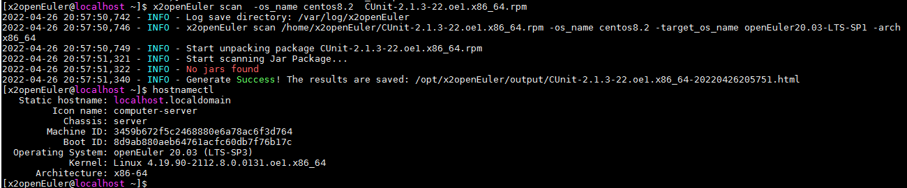
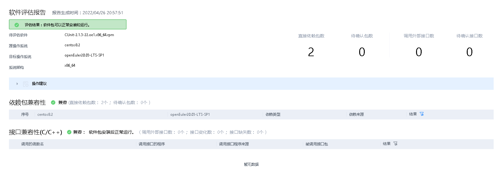

目录

[简介](#简介)

[环境要求](#环境要求)

[重要说明](#重要说明)

[工具安装](#工具安装)

[测试执行](#测试执行)

# 简介
本指导书简要介绍x2openEuler2.0部署和软件评估的步骤,详情请前往[x2openEuler用户指南](https://gitee.com/openeuler/docs/blob/stable2-20.03_LTS_SP1/docs/zh/docs/thirdparty_migration/x2openEuleruseguide.md#x2openeuler-%E7%94%A8%E6%88%B7%E6%8C%87%E5%8D%97)查看。


# 环境要求

| 项目  |  说明  |
| ------------ | ------------------------ |
| 服务器   | 当前支持Kunpeng和X86底座，有其他平台的适配需求欢迎提交issue |
| 操作系统  |  openEuler系操作系统、CentOS 7.6及以后版本　 |

# 重要说明
1. 部分测试用例会重启机器，请勿在生产环境安装和执行测试工具。
2. 工具安装过程需要从外网下载代码和依赖包，请确保网络连接（如不通外网，需要下载相关依赖并进行安装）。
3. 工具安装路径和日志存放在/opt下，请确保目录剩余空间足够。

# 工具安装
## 步骤1. 安装依赖
    
    yum install -y bzip2 bzip2-devel

## 步骤2. 下载x2openEuler安装包


    AARCH64请执行以下命令：
    wget https://repo.oepkgs.net/openEuler/rpm/openEuler-20.03-LTS-SP1/contrib/x2openEuler/aarch64/Packages/x2openEuler-2.0.0-430.aarch64.rpm
    X86请执行以下命令
    wget https://repo.oepkgs.net/openEuler/rpm/openEuler-20.03-LTS-SP1/contrib/x2openEuler/x86_64/Packages/x2openEuler-2.0.0-430.x86_64.rpm
    版本变更下载地址可能会变动，可以访问 https://repo.oepkgs.net/openEuler/rpm/openEuler-20.03-LTS-SP1/contrib/x2openEuler/`uname -m`/Packages/ 获取

## 步骤3. 安装x2openEuler
    
    yum install x2openEuler-2.0.0-1.x86_64.rpm

## 步骤4. 设置x2openEuler密码
    
    passwd x2openEuler
说明： 登录用户的密码。密码建议满足如下复杂度要求：
- 密码长度为8~32个字符
- 必须包含大写字母、小写字母、数字、特殊字符（~!@#$%^&*()-_=+\|[{}];:'",<.>/?）中的两种及以上类型的组合
- 密码不能包含空格
- 密码不能是用户名

### --结束

# 测试执行
## 步骤1. 切换到x2openEuler用户

须知： 使用前请务必**切换用户为x2openEuler用户**

    su - x2openEuler

## 步骤2. 执行扫描   

命令格式
```shell
x2openEuler scan [-batch] [-arch ARCH] [-os_name OS_NAME] [-target_os_name TARGET_OS_NAME] {filename | directoryname}
```

**参数说明**

<table>
  <thead>
    <tr>
      <th>命令</th>
      <th>参数选项</th>
      <th>说明</th>
    </tr>
  </thead>
  <tbody>
    <tr>
      <td >-batch</td>
      <td>-</td>
      <td>多应用场景，配合directoryname，扫描文件夹下多个软件包若无此参数，仅扫描单个软件包</td>
    </tr>
    <tr>
      <td rowspan="3">-arch</td>
      <td rowspan="3">ARCH</td>
      <td>操作系统架构  可选参数</td>
    <tr>
      <td>可选x86_64或aarch64，默认为x86_64</td>
    </tr>
    <tr>
      <td>例如"-arch x86_64" 选择操作系统架构为x86_64</td>
    </tr>
    <tr>
      <td rowspan="4">-os_name</td>
      <td rowspan="4">OS_NAME</td>
      <td>源操作系统  可选参数</td>
    <tr>
      <td>默认参数为centos7.6</td>
    </tr>
    <tr>
      <td>例如"-os_name centos8.2" 选择源操作系统为CentOS 8.2</td>
    </tr>
    <tr>
      <td>说明：当前源操作系统支持CentOS 6.8/CentOS 7.6/CentOS 8.2</td>
    <tr>
    <tr>
      <td rowspan="3">- target_os_name</td>
      <td rowspan="3">TARGET_OS_NAME</td>
      <td>目标操作系统  可选参数</td>
    <tr>
      <td>默认参数为openEuler20.03-LTS-SP1</td>
    </tr>
    <tr>
      <td>例如"-target_os_name openEuler20.03-LTS-SP1" 选择目标操作系统为openEuler20.03-LTS-SP1</td>
    </tr>
    <tr>
      <td rowspan="3">-</td>
      <td rowspan="3">filename| directoryname</td>
      <td>需要扫描的应用包或目录</td>
    <tr>
      <td>例如"x2openEuler scan file_name_version.rpm" 　选择扫描的应用包为file_name_version.rpm</td>
    </tr>
    <tr>
      <td>说明：当前扫描支持rpm/tar/zip/gzip/jar/py/pyc/sh/bin文件</td>
    </tr>
  </tbody>
</table>

此处以评估CUnit-2.1.3-21.oel.aarch64.rpm_应用包并输出软件评估报告为例，请根据实际情况选择所需参数并替换为需要扫描的软件包或软件包目录。
```shell
x2openEuler scan -arch x86_64   CUnit-2.1.3-21.oel.x86_64.rpm
```


## 步骤3. 结果查看
报告为html格式，建议下载报告并在浏览器查看：


*说明： 软件兼容性评估报告分四块内容展示软件兼容性，分别是依赖包兼容性、C/C++接口兼容性、jdk接口兼容性和java接口兼容性。*
1. 依赖包兼容性：反映了软件包安装过程中的直接依赖，非100%表明无法正确安装。
2. 接口兼容性：反映的是单个软件运行过程中对其他软件包、动态库或系统接口的调用变化，非100%表明在某个功能调用时可能会触发异常。 部分结果建议人工复核，最终软件包使用优先级建议 openEuler已移植包>openEuler上人工重编译包>centos软件包。

### -- 结束


