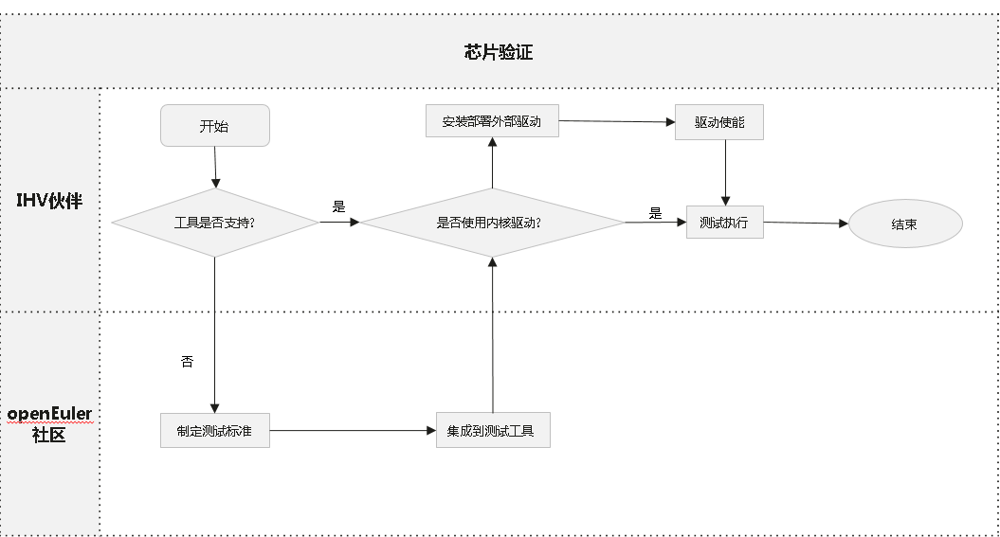

目录

[1 简介](#简介)

[2 环境要求](#环境要求)

[3 重要说明](#重要说明)

[4 工具安装](#工具安装)

[5 测试执行](#测试执行)


# 简介

为解决欧拉技术测评过程中涉及的整机和板卡兼容性测试问题，特基于[《欧拉技术测评兼容性测试用例（整机&板卡）》](../testing-standard/欧拉技术测评兼容性测试用例（整机&板卡）.md) 集成了oec-hardware测试工具。
此工具将根据《欧拉技术测评兼容性测试用例（整机&板卡）》提取为58个自动化测试用例，分为整机测试用例集和板卡测试用例集

# 环境要求

## 整机测试环境要求

|   项目    |                       要求                    |
|-----------|---------------------------------------------|
|    整机数量   | 需要两台整机，业务网口互通   |
|    硬件   | 至少有一张RAID卡和一张网卡（包括集成主板硬件)   |
|    内存   | 建议满配   |
|  操作系统  |               openEuler系操作系统（支持dnf/yum/pip3)           |

## 板卡测试环境要求

|   项目    |                       要求                    |
|-----------|---------------------------------------------|
|    服务器型号   | Taishan200(Model 2280)、2288H V5或同等类型的服务器，对于x86_64服务器，icelake/cooperlake/cascade可任选一种，优选icelake   |
|    RAID卡   | 需要组raid，至少组raid0   |
|    NIC/IB卡   | 服务端和测试端需要分别插入一张同类型板卡，配置同网段IP，保证直连互通  |
|    FC卡   | 需要连接磁阵，至少组两个lun   |
|  操作系统  |               openEuler系操作系统（支持dnf/yum/pip3)            |


# 重要说明

1. 部分测试用例会重启机器，请勿在生产环境安装和执行测试工具。

2. 工具安装过程需要从外网下载代码和依赖包，请确保网络连接（如不通外网，需要下载相关依赖并进行安装）。

3. 工具日志默认存放在/usr/share，请确保目录剩余空间足够。

# 芯片验证说明

芯片验证和测试的流程如下：



1. 芯片使能测试前，请确认工具支持测试该类型的芯片；如果工具不支持，请联系openEuler兼容性sig组 oecompatibility@openeuler.org 联合制定测试标准，在工具中集成测试用例；

2. 工具默认测试内核驱动，如果需要测试外部驱动，请自行安装部署驱动；

3. 测试环境准备完毕，安装测试工具，执行测试。

# 工具安装

## 安装过程

### 客户端

1. 配置 [openEuler 官方 repo](https://repo.openeuler.org/) 中对应版本的 everything 和 update 源，使用 `dnf` 安装客户端 oec-hardware。

   ```
   dnf install oec-hardware
   ```

2. 输入 `oech` 命令，可正常运行，则表示安装成功。

### 服务端

1. 配置 [openEuler 官方 repo](https://repo.openeuler.org/) 中对应版本的 everything 和 update 源，使用 `dnf` 安装服务端 oec-hardware-server。

   ```
   dnf install oec-hardware-server
   ```

2. 服务端 web 展示页面需要的部分组件系统本身不提供，需要使用 `pip3` 安装（请自行配置可用 pip 源）。

   ```
   pip3 install Flask Flask-bootstrap uwsgi
   ```

3. 启动服务。本服务默认使用 8080 端口，同时搭配 nginx（默认端口 80）提供 web 服务，请保证这些端口未被占用。

   ```
   systemctl start oech-server.service
   systemctl start nginx.service
   ```

4. 关闭防火墙和 SElinux。

   ```
   systemctl stop firewalld
   iptables -F
   setenforce 0
   ```

# 测试执行

## 前提条件

* `/usr/share/oech/kernelrelease.json` 文件中列出了当前支持的所有系统版本，使用`uname -a` 命令确认当前系统内核版本是否属于框架支持的版本。

* 框架默认会扫描所有网卡，对网卡进行测试前，请自行筛选被测网卡，并给它配上能 `ping` 通服务端的 ip；如果客户端是对 InfiniBand 网卡进行测试，服务端也必须有一个 InfiniBand 网卡并提前配好 ip 。建议不要使用业务网口进行网卡测试。

* 部分用例需要root权限，请使用root用户执行。

## 使用步骤

1. 启动测试工具

   在完成安装oec-hardware软件包的客户端执行 `oech`，填写`ID`、`URL`、`Server`配置项，`ID` 建议填写 gitee 上的 issue ID（注意：`ID`中不能带特殊字符）；`URL`建议填写产品链接；`Server` 必须填写为客户端可以直接访问的服务器域名或 ip，用于展示测试报告和作网络测试的服务端。

   ```
   # oech
   The openEuler Hardware Compatibility Test Suite
   Please provide your Compatibility Test ID:
   Please provide your Product URL:
   Please provide the Compatibility Test Server (Hostname or Ipaddr):
   ```

2. 进入测试套选择界面

   在用例选择界面，框架将自动扫描硬件并选取当前环境可供测试的测试套，输入 `edit` 可以进入测试套选择界面。

   * 板卡测试请选择对应的板卡测试项。
   
   * 整机测试建议测试全部类型的测试项，至少需要测试一张RAID卡和网卡，网卡测试选择一个网口即可，注意不要使用业务网口进行测试。

   ```
   These tests are recommended to complete the compatibility test:
   No. Run-Now?  Status  Class         Device
   1     yes     NotRun  acpi
   2     yes     NotRun  clock
   3     yes     NotRun  cpufreq
   4     yes     NotRun  disk
   5     yes     NotRun  ethernet      enp3s0
   6     yes     NotRun  ethernet      enp4s0
   7     yes     NotRun  ethernet      enp5s0
   8     yes     NotRun  kdump
   9     yes     NotRun  memory
   10    yes     NotRun  perf
   11    yes     NotRun  system
   12    yes     NotRun  usb
   13    yes     NotRun  watchdog
   Ready to begin testing? (run|edit|quit)
   ```

3. 选择测试套

   `all|none` 分别用于 `全选|全取消`（必测项 `system` 不可取消，多次执行成功后 `system` 的状态会变为`Force`）；数字编号可选择测试套，每次只能选择一个数字，按回车符之后 `no` 变为 `yes`，表示已选择该测试套。

   ```
   Select tests to run:
   No. Run-Now?  Status  Class         Device
   1     no      NotRun  acpi
   2     no      NotRun  clock
   3     no      NotRun  cpufreq
   4     no      NotRun  disk
   5     yes     NotRun  ethernet      enp3s0
   6     no      NotRun  ethernet      enp4s0
   7     no      NotRun  ethernet      enp5s0
   8     no      NotRun  kdump
   9     no      NotRun  memory
   10    no      NotRun  perf
   11    yes     NotRun  system
   12    no      NotRun  usb
   13    no      NotRun  watchdog
   Selection (<number>|all|none|quit|run):
   ```

4. 开始测试

   选择完成后输入 `run` 开始测试。

5. 上传测试结果

   测试完成后可以上传测试结果到安装oec-hardware-server软件包的服务端，便于结果展示和日志分析。如果上传失败，请检查网络配置，然后重新上传测试结果。

   ```
   ...
   -------------  Summary  -------------
   ethernet-enp3s0                  PASS
   system                           PASS
   Log saved to /usr/share/oech/logs/oech-yyyymmddxxxx-xxxxxxx.tar succ.
   Do you want to submit last result? (y|n) y
   Uploading...
   Successfully uploaded result to server X.X.X.X.
   ```

6. 查看工具的测试日志
   
   客户端详细的测试日志路径为 `/usr/share/oech/logs/oech-yyyymmddxxxx-xxxxxxx.tar` 。

7. 查看测试结果。

   测试结果上传到服务端后，在浏览器打开服务端 IP 地址，点击导航栏 `Results` 界面，找到对应的测试 id 进入，可以看到具体的测试结果展示，包括环境信息和执行结果等。
