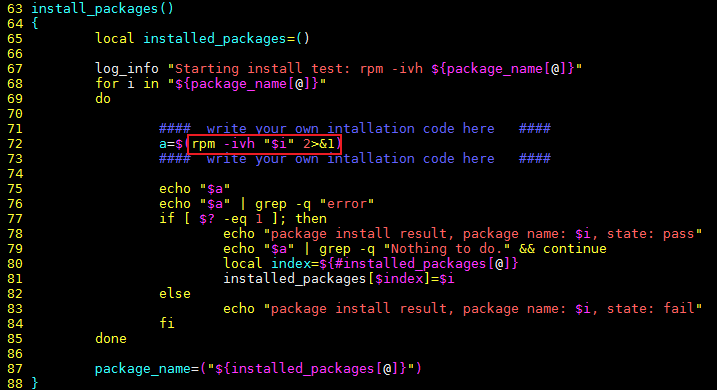
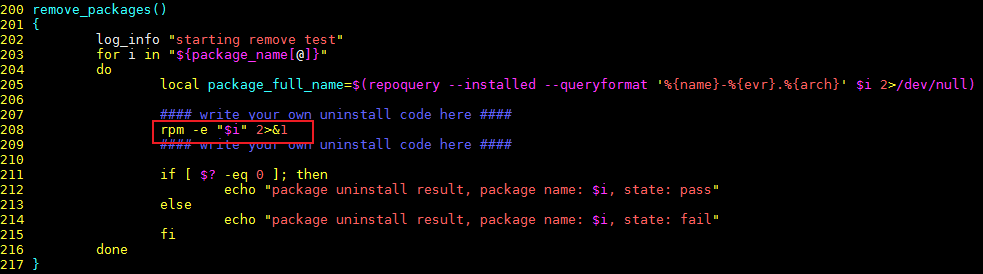
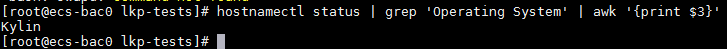

目录

[1 简介](#简介)

[2 环境要求](#环境要求)

[3 重要说明](#重要说明)

[4 工具安装](#工具安装)

[5 测试套安装](#测试套安装)

[6 测试执行](#测试执行)

[7 修改安装和卸载命令](#修改安装和卸载命令)

[8 FAQ](#FAQ)

# 简介
为解决欧拉技术测评过程中涉及的ISV商用软件兼容性测试问题，特基于[《欧拉技术测评兼容性测试用例（ISV商用软件）》](../testing-standard/欧拉技术测评兼容性测试用例（ISV商用软件）.md) 集成了lkp-tests测试工具。
此工具将根据《欧拉技术测评兼容性测试用例（ISV商用软件）》提取为11个自动化测试用例，分为构建测试、兼容性测试、性能测试和安全测试4个维度

# 环境要求
|   项目    |                       要求                    |
|-----------|---------------------------------------------|
|  操作系统  |               openEuler系操作系统            |
|  依赖软件  | 请使用此命令安装依赖包：yum install -y wget git|

# 重要说明
1. 请勿在生产环境安装和执行测试工具
2. 工具安装过程需要从外网下载代码和依赖包，请确保网络连接（如不通外网，需要将gem相关依赖完全离线并进行安装）。
3. 工具默认安装在当前目录，请确保目录剩余空间足够。

# 工具安装
## 步骤1. 依赖安装
    
    yum install -y wget git rubygems-devel

## 步骤2. 获取工具源码

    git clone https://gitee.com/wu_fengguang/lkp-tests
## 步骤3. 修改ruby gems源。

    
    cd lkp-tests
    git reset --hard d83fd174a6af948d95af4423ef84acc437ea9e92
    sed -i "s/rubygems.org/gems.ruby-china.com/g" Gemfile
    gem sources --remove https://rubygems.org/
    gem sources -a https://gems.ruby-china.com/
## 步骤4. 执行安装

    make install
## 步骤5. 写入环境变量
    
    将lkp-tests所在路径写入/etc/profile末尾，方便后续测试
    vi /etc/profile

    export LKP_PATH="填写lkp-tests所在路径"
vi 打开文件后，"ctrl"+"g"跳到文件末尾，然后按下"o" 编辑下一行；

输入完成后，"esc"退出编辑，然后输入":wq"+"enter"保存并退出文件。

## 步骤6. 使环境变量生效
    
    source /etc/profile
### -- 结束

# 测试套安装
## 步骤1. 下载测试套。

    git clone https://gitee.com/whatamaze/compatibility-test 
## 步骤2. 安装测试套

     cd compatibility-test
     sh install.sh
### -- 结束

# 测试执行
## 步骤1. 安装通用依赖

    export arch=`arch`
    gem uninstall git -a
    gem install git -v 1.9.1
    lkp install
    # 注意：这里必须安装1.12以下版本的git，否则会导致接口传参出错。
## 步骤2. 安装兼容性测试依赖
     
    lkp split-job $LKP_PATH/jobs/compatibility-test.yaml
    lkp install -f compatibility-test-defaults.yaml
执行成功后会在执行命令目录生成 compatibility-test-defaults.yaml 文件，用于后续任务调度，后续执行## 步骤3，也需要切换到此目录。

## 步骤3. 执行兼容性测试
    
    将待测软件包放到当前目录下，执行以下命令，最终测试结果在compatibilityLog文件中
    lkp run ./compatibility-test-defaults.yaml -s 'package_name: xxxxxx' >compatibilityLog 2>& 1
1. package_name: 后必须有一个空格，否则导致报错无法进行测试
2. 此处package_name后需填写软件包文件全名，例如nginx-1.14.2-1.oe1.aarch
3. 当前脚本适配rpm包，如无法直接使用rpm -ivh等rpm命令进行安装、卸载，请根据在脚本中修改安装卸载命令，详见[修改安装和卸载命令](#修改安装和卸载命令)

### -- 结束

# 修改安装和卸载命令
本章节相关操作需保证兼容性测试套已成功安装，未安装请见[测试套安装](#测试套安装)章节。

当前默认脚本为rpm包的安装和卸载，如被测软件安装包为其他格式，安装命令不同，则需修改安装和卸载命令，详见## 步骤信息。

如果是JAVA Web等不涉及安装的项目，可以将安装卸载命令修改为启动和停止命令。

## 步骤1. 修改安装命令
    
    vi $LKP_PATH/tests/compatibility-test

    修改72行的安装命令，将安装命令的执行结果保存到变量a中
    下面76行将出现"error"报错识别为失败，如安装过程失败提示非"error"字样，请根据实际情况修改。

## 步骤2. 修改卸载命令
    
    vi $LKP_PATH/tests/compatibility-test

    修改208行的卸载命令，如无出现报错，即认为修改成功

# FAQ
## 1. lkp install报错“Not a supported system”
lkp-tests 根据操作系统的名称来匹配运行的脚本，当前脚本已匹配openEuler社区版本、Kylin、UOS、FusionOS和TurboLinux商业发行版，其他openEuler系发行版，需根据以下## 步骤，新增适配
## 步骤1. 获取操作系统名称
    
    cd $LKP_PATH
    os_name=$(hostnamectl status | grep 'Operating System' | awk '{print $3}')
以Kylin V10 sp2为例

## 步骤2. 添加适配文件
    
    ln -s distro/aliyun distro/${os_name,,}
    cp distro/installer/openeuler distro/installer/${os_name,,}
    sed -i "s/OPENEULER/${os_name^^}/g" distro/installer/${os_name,,}
    ln -s distro/adaptation-pkg/openeuler distro/adaptation-pkg/${os_name,,}
    \cp -f distro/adaptation/openeuler distro/adaptation/${os_name,,}
## 步骤3. 执行安装
    
    lkp install
### -- 结束
