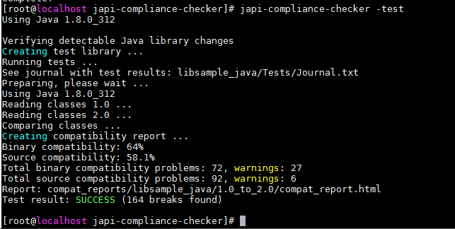

目录

[简介](#简介)

[环境要求](#环境要求)

[重要说明](#重要说明)

[依赖安装](#依赖安装)

[工具安装](#工具安装)

[测试执行](#测试执行)


# 简介
OECP工具比较的是2个ISO之间的静态差异，OECP工具需借助compass-ci才能比较2个ISO之间的动态差异。在测试完成输出的OSV认证报告中，静态差异测试的是工具检测的检测项，动态差异才包括平台验证的检测项。

本指导书是对OECP工具测试openEuler-20.03-lts-sp1.aarch64-dvd.iso和openEuler-20.03-lts.aarch64-dvd.iso静态差异的输出结果进行分析的
 
# 环境要求
| 组件  |  说明 |
| ------------ | ------------ | 
| 服务器   | 当前支持Kunpeng和X86底座，有其他平台的适配需求欢迎提交issue |
| 操作系统  |  openEuler系操作系统　 |
| 依赖软件  |  python3-devel，sqlite，libabigail，japi-compliancechecker，安装方法见工具安装 |

# 重要说明
1. 请勿在生产环境安装和执行测试工具
2. 工具安装过程需要从外网下载代码和依赖包，请确保网络连接（如不通外网，需要将gem相关依赖完全离线并进行安装）。
3. 工具默认安装在当前目录，请确保目录剩余空间足够。

# 依赖安装
## 步骤1. 安装依赖
    yum install -y python3-devel sqlite libabigail-devel python3-pip
    pip3 install pyyaml

## 步骤2. 安装japi-compliance-checker
    
    git clone https://github.com/lvc/japi-compliance-checker.git
    cd japi-compliance-checker
    make install prefix=/usr
## 步骤3. 安装结果检测
    
    japi-compliance-checker -test

### -- 结束

# 工具安装
## 步骤1. 下载源码

    git clone https://gitee.com/openeuler/oecp.git
## 步骤2. 执行安装
    
    cd oecp
    pip3 install -r requirement
### -- 结束

# 测试执行
## 步骤1. 执行测试
    
    python3  cli.py   file1  file2

```
#file1: 待测试的目标ISO
#file1: 基线ISO，用于和目标ISO对比
```
## 步骤2. 查看结果
    
    在结果文件osv_data_summary.xlsx中查看测试结果


### -- 结束


