# openEuler技术测评平台用户指南

## 介绍
openEuler技术测评平台（简称：测评平台）地址为：[https://certification.openeuler.org](https://certification.openeuler.org)，用于承载OSV/IHV/ISV合作伙伴的openEuler技术测评流程，包括伙伴账号注册和技术测评两个大模块。本指南主要介绍测评平台具体操作。

## 账号注册与企业认证流程
流程如下：

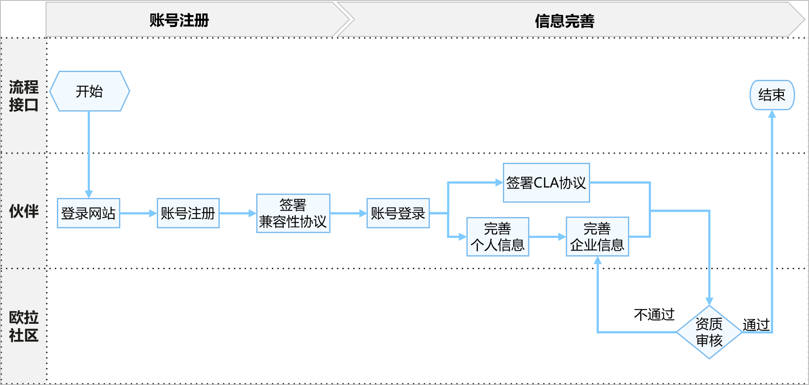

以下是详细流程步骤：

- 步骤1：账号注册（已完成账号注册的可跳过该步骤）

  伙伴登录[技术测评平台](https://certification.openeuler.org)，完成账号注册：

  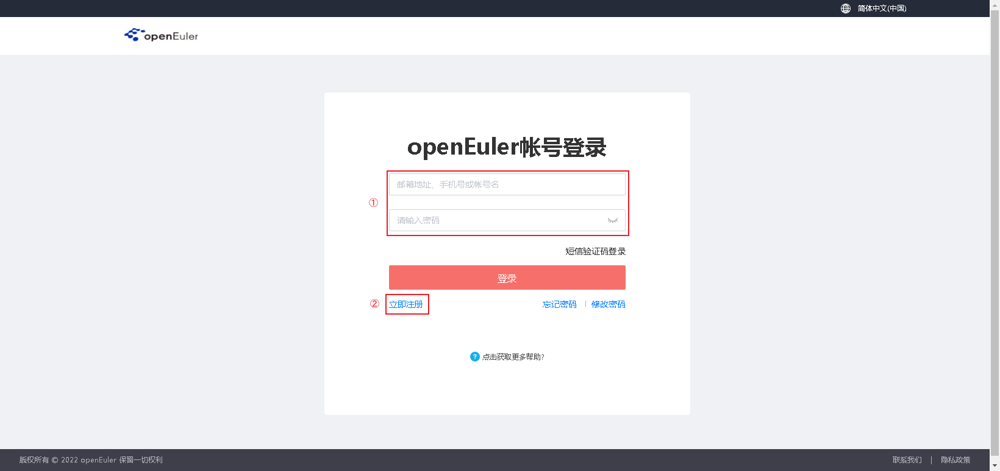

  完善个人信息，点击页面右上角 “用户名（注册时填写的用户名）” -> “个人中心”

  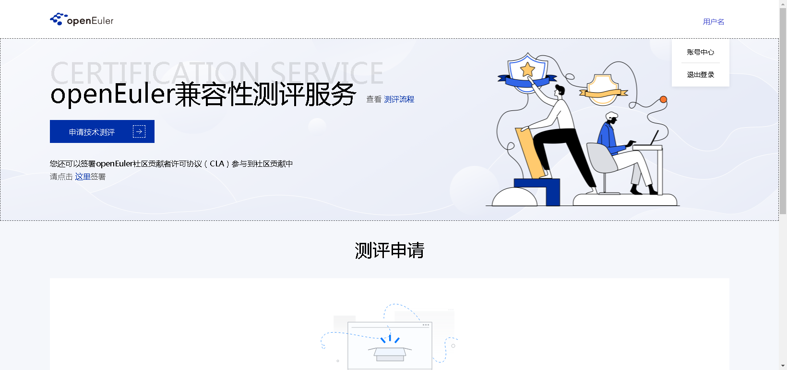

  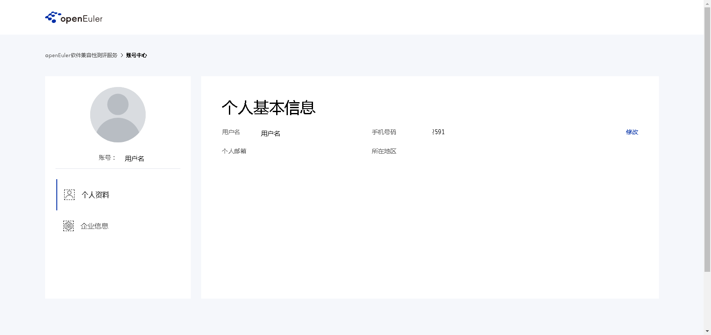
  > **注意**：
  >
  > 此处的邮箱要与之后签署CLA的邮箱保持一致

  如果需要修改邮箱可以在”账号绑定”处进行修改
  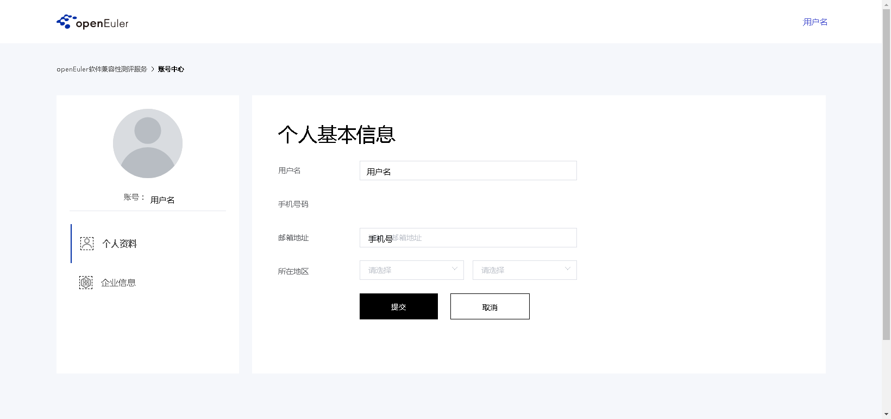

- 步骤2：CLA签署

  点击首页的“CLA签署”或者访问“[https://www.openeuler.org/zh/community/contribution/](https://www.openeuler.org/zh/community/contribution/)”，点击左下角的“openEuler社区贡献者许可协议”进入CLA签署页面

  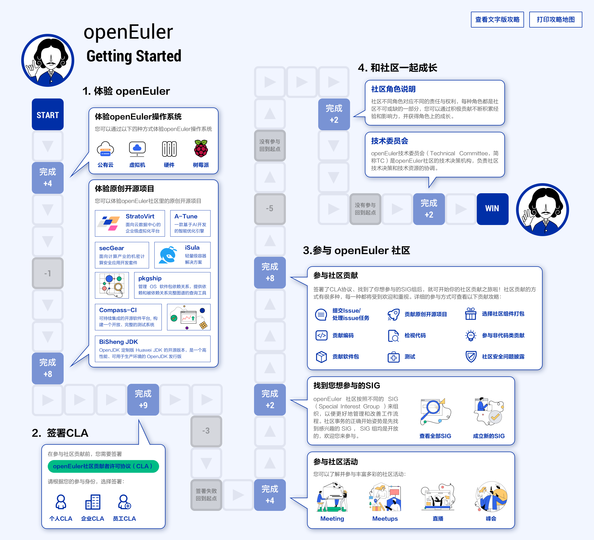
  ①.如果企业还未签署过法人CLA（企业CLA）那么就需要先签署法人CLA（企业CLA）才能去签署员工CLA（法人贡献者登记）。
  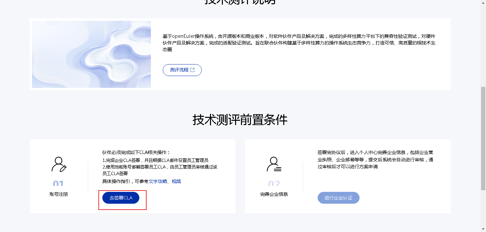

  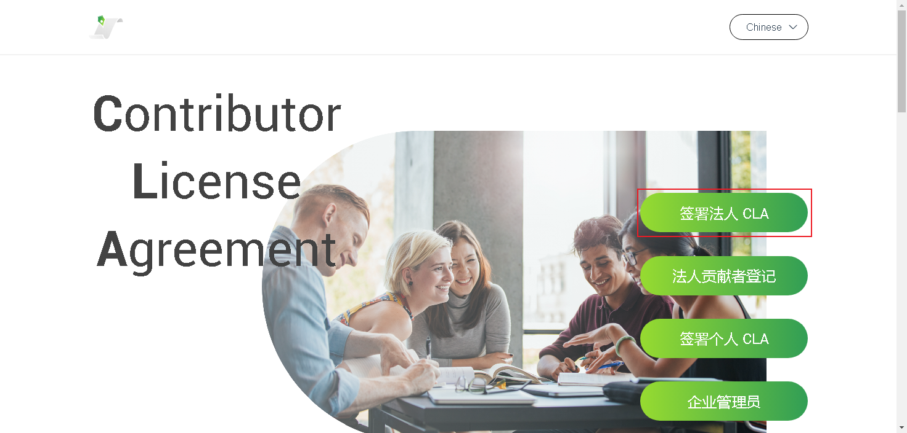
  
  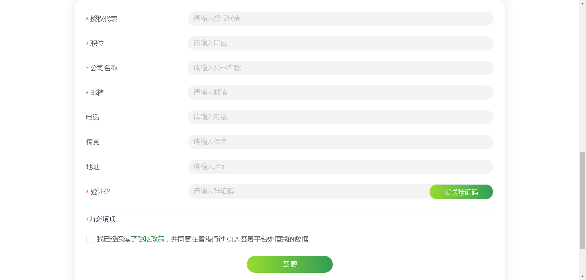
  完成以上内容后，点击签署，稍后该邮箱就会收到社区发来的签署企业CLA的文件，按照邮件中的提示完成后续签署，之后社区管理员审批企业签署的企业 CLA 文件，开通企业在该社区的 Administrator账号。最终企业登录超级管理员后台增加员工管理员，下载企业 CLA 文件等。注意：员工管理员可以不用签署员工CLA（法人贡献者登记），他的主要作用是激活自己公司提交上来的员工CLA（法人贡献者登记）签署；如果超级管理员与管理员都想要发起认证的话那么也是需要签署员工CLA的。
  
  ②. 员工CLA（法人贡献者登记）的签署
  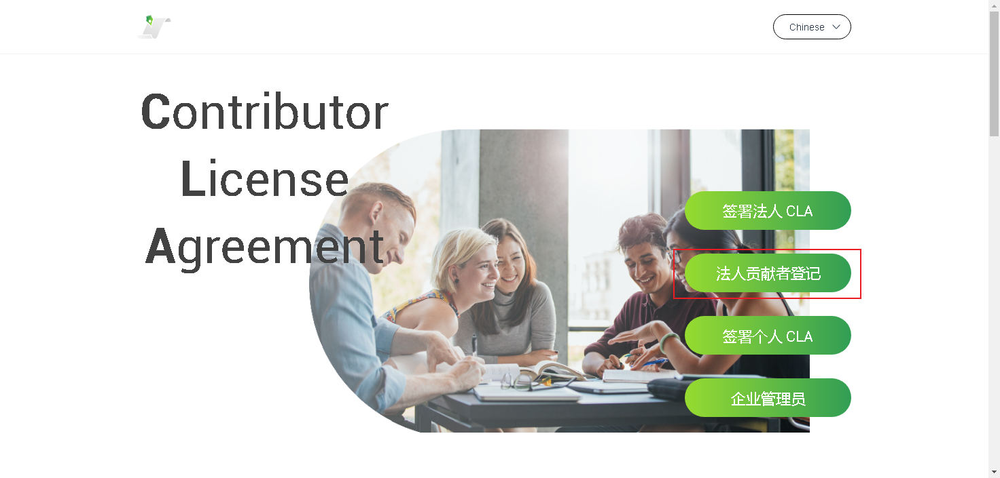
  
  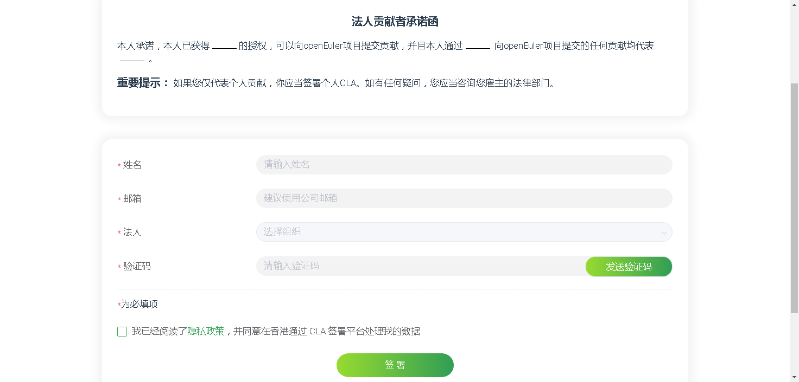

  填写并完成以上内容后，找到贵司的管理员让他激活即可。	

- 步骤3：企业认证

  前提：完成了CLA的签署
  
  点击“进行企业认证”进入如下页面：
  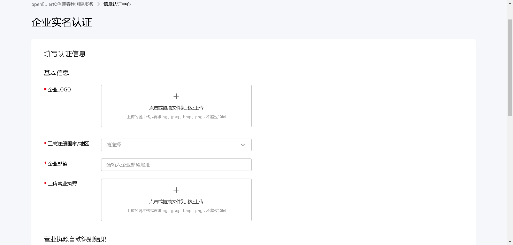

  需提交企业LOGO（透明底）、工商注册国家/地区、企业邮箱、上传营业执照。
  
  上传营业执照后，会自动从营业执照中提取信息，包括以下字段：
  > **注意**：
  >
  > 1. 自动提取有一定的失败率，提取后请再次确认。确认无误后，点击“提交”完成企业认证。系统会自动根据提交的信息，确认企业信息是否有效。
  > 2. 如企业信息验证不通过，请检查企业名称是否带有中文括号，如有，请切换为英文括号后重试。
  
  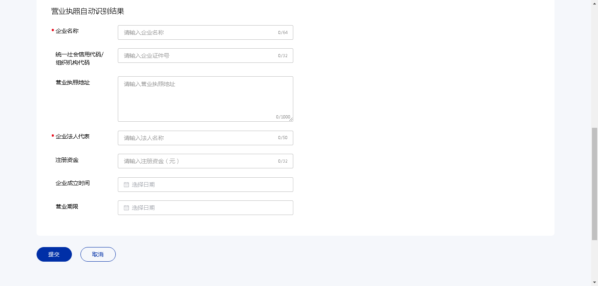
  提交后，三个工作日内完成审核。
  至此，完成伙伴账号的注册和认证。

## openEuler技术测评申请流程
伙伴申请openEuler兼容性技术测评流程如下：

前提：伙伴完成[账号注册与企业认证流程](#账号注册与企业认证以及CLA签署的流程)

- 步骤1：技术测评申请
  
  伙伴访问[技术测评平台](https://certification.openeuler.org)，点击“申请技术测评”

  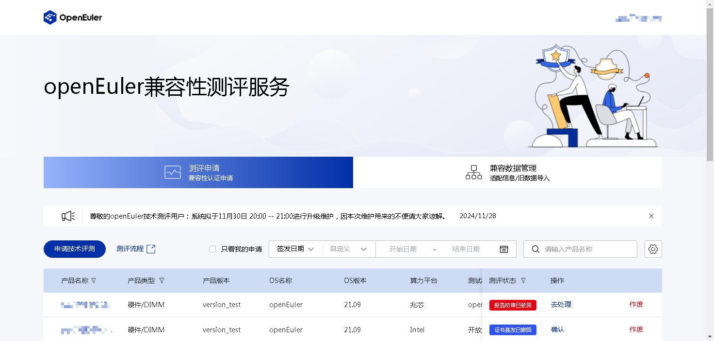
  
- 步骤2：填写方案信息
  
  点击“申请技术测评”， 根据提示，完善方案信息和测试环境信息：
  
  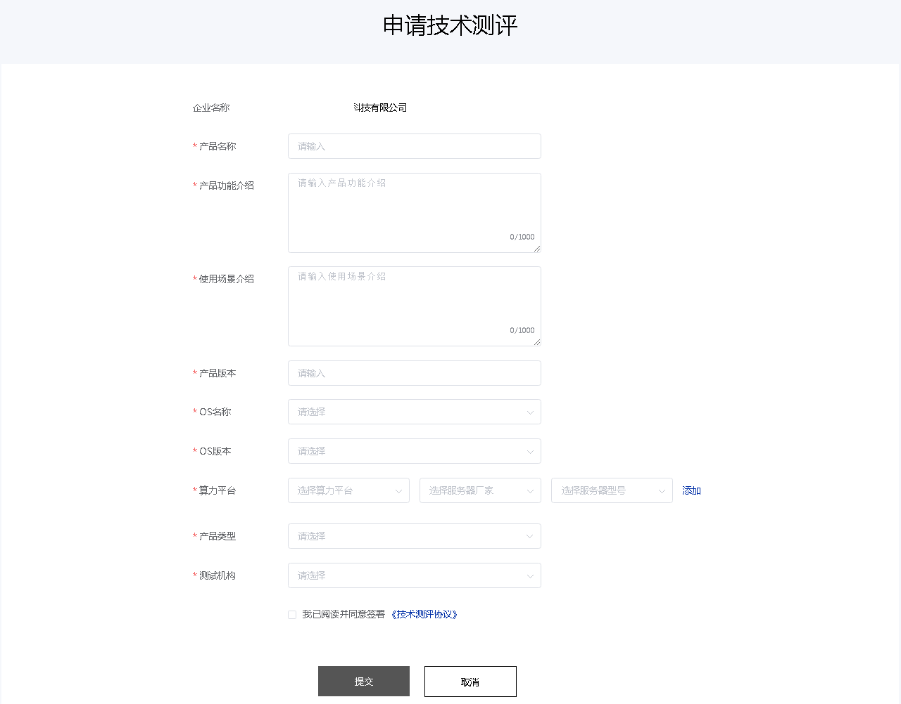
  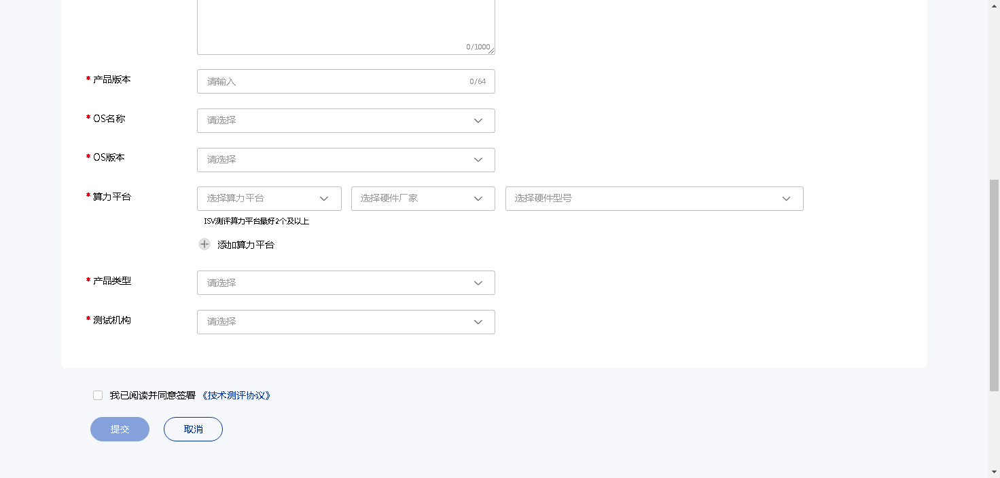
  > **注意**：
  >
  > 1. openEuler兼容性技术测评要求适配多算力平台，因此，此处的算力平台需**至少选择2个算力平台（OSV/IHV可以只选择1个）**。
  > 2. 为确保最终证书生成的效果，**算力平台选择最多不超过8个**，如您想体现多算力，请以“[xx算力平台]/其他/其他”方式进行概括选择。
  > 3. **测试机构选择任意创新中心**，如测评过程有任何问题可基于[支撑矩阵](https://gitee.com/openeuler/technical-certification/issues/I9MY2A?from=project-issue)进行联系。
  
  完善提交后，会自动返回主页面，可以在“测评申请”列表查看到对应的方案
  
  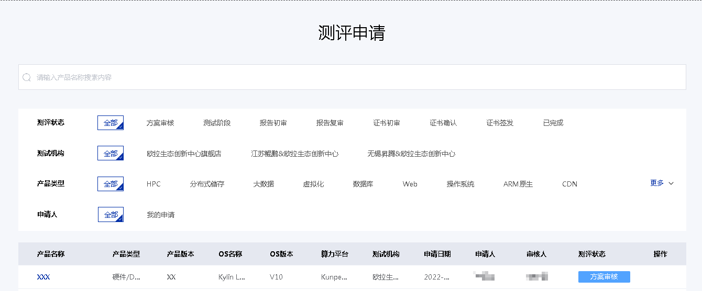
  
  点击方案，可以进入详情页查看方案详情和各个阶段的处理人。**默认方案审核在1个工作日内完成**（如未及时处理，请基于[支撑矩阵](https://gitee.com/openeuler/technical-certification/issues/I9MY2A?from=project-issue)跟催），如果审核不通过，方案会驳回到提交人，此时提交人需查看驳回原因，修改后重新提交。
  
  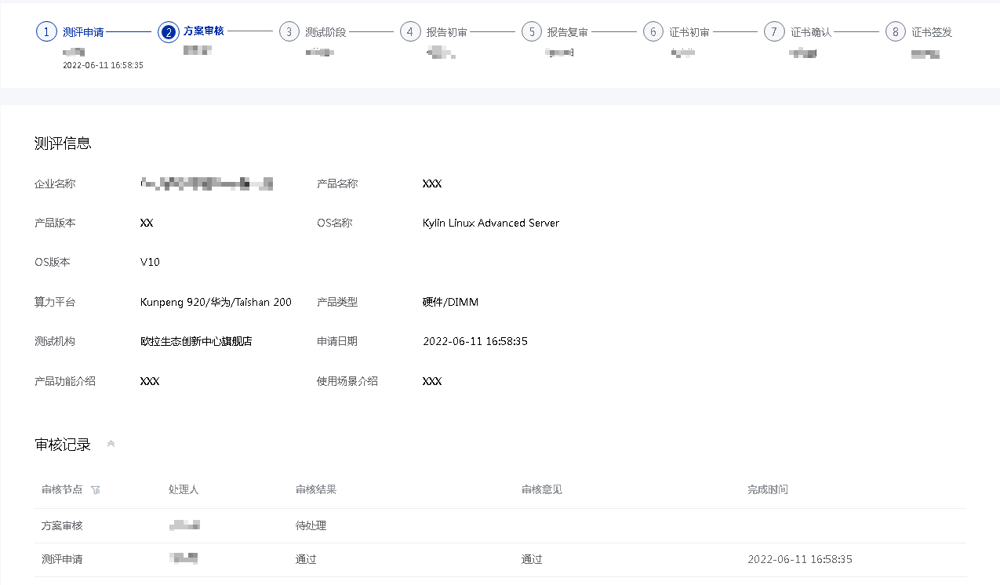
  
- 步骤3：执行测试

  根据[技术测评测试标准](https://gitee.com/openeuler/technical-certification)对方案进行测试，并提交测试报告：

  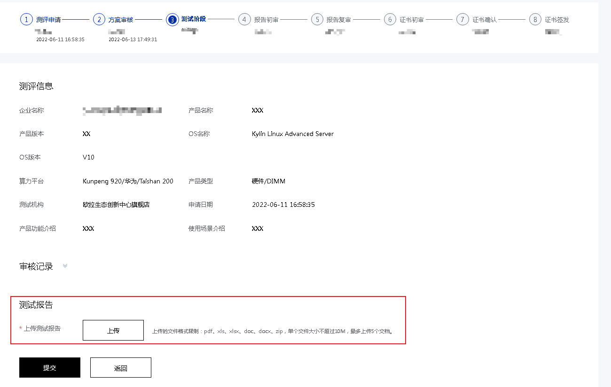

  上传后，创新中心及社区负责人会对测试报告进行审核，通过审核后，即可进入证书签发的流程，社区负责人对证书信息进行初审，确认证书信息与实际测试内容一致后通过审核，由伙伴进行证书确认。

- 步骤4：证书确认

  通过社区的证书初审后，申请人需要进行证书确认，页面如下：

  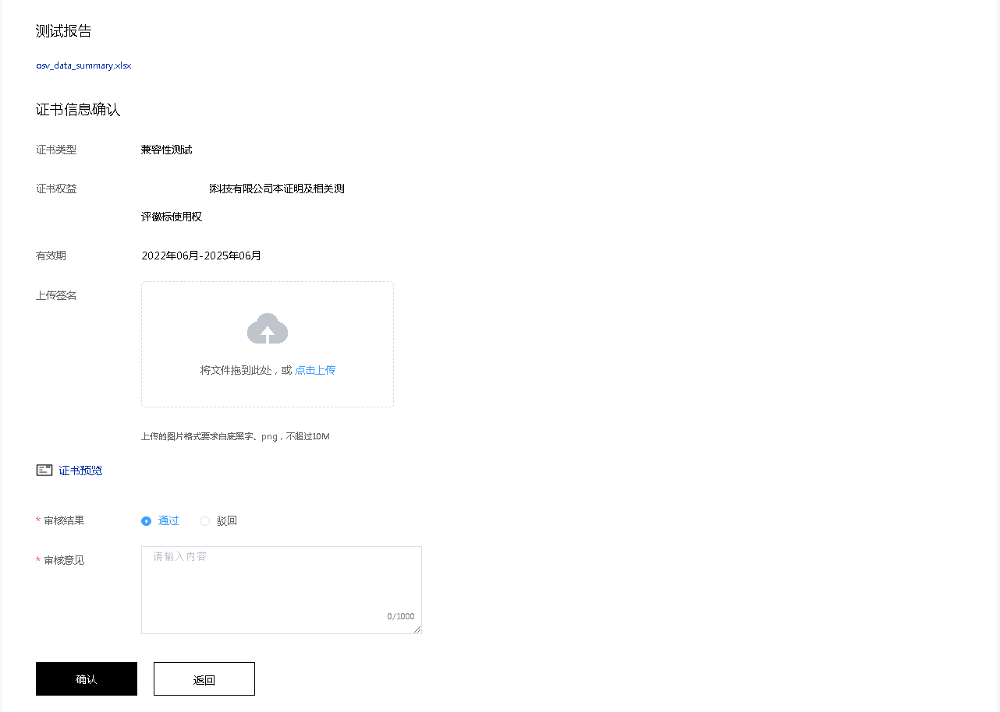

  申请人需要确认证书上软件的信息、测试环境信息等是否准确无误，确认准确无误后，需上传伙伴的签名/签章(透明底)，用于后续证书生成。申请人也可以点击“证书预览”，查看证书预览页面。

  > 上传签名/签章不是必须项，如您认为签名/签章信息敏感，可选择不上传，直接生成证书。

- 步骤5. 兼容性信息发布

  证书确认后，社区负责人将会进行最终的证书签发，签发后，兼容性信息会自动同步到openEuler社区[兼容性清单](https://www.openeuler.org/zh/compatibility/)。

