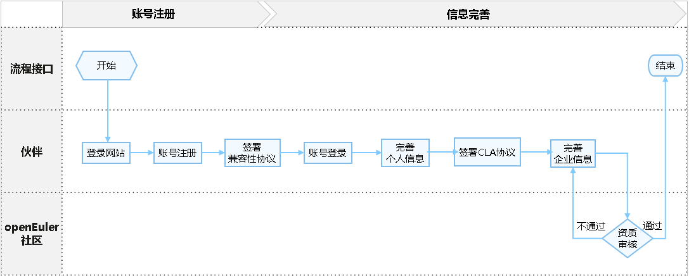
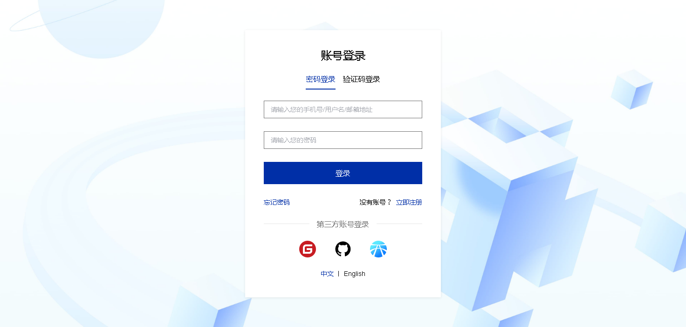
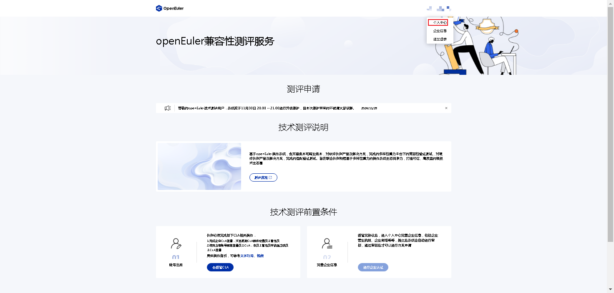
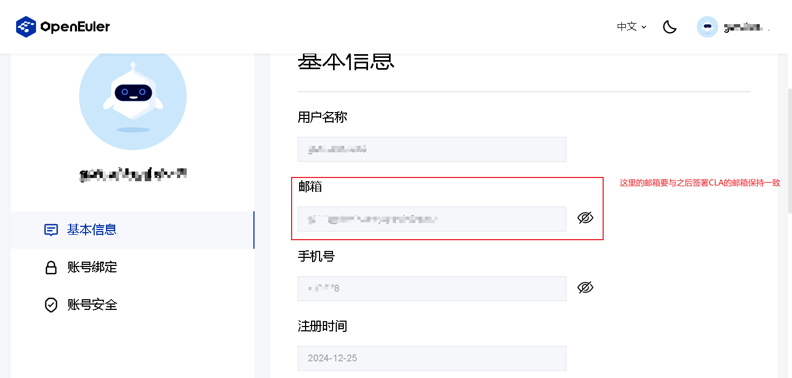
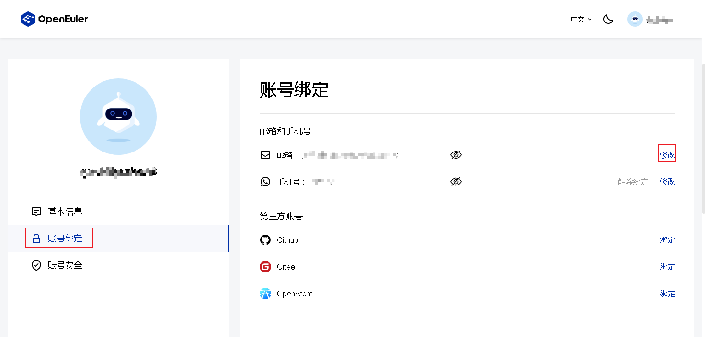
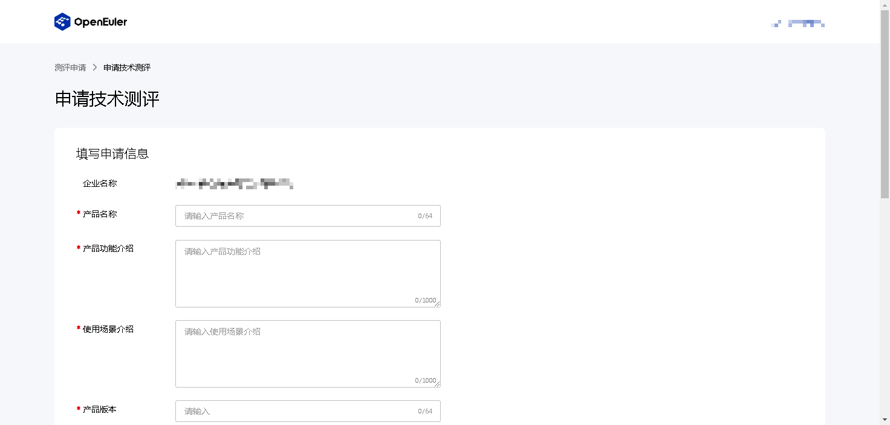
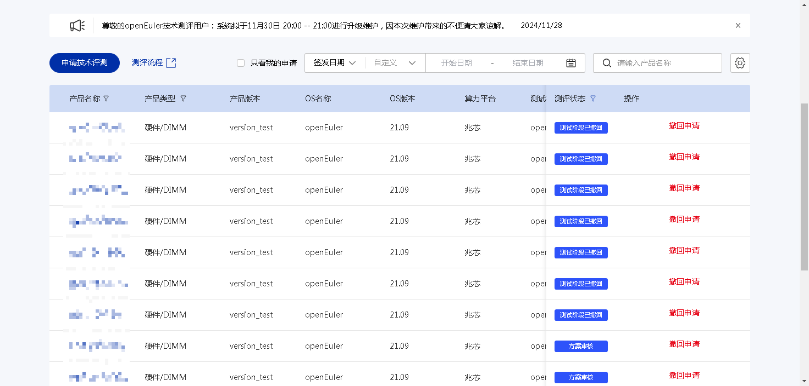
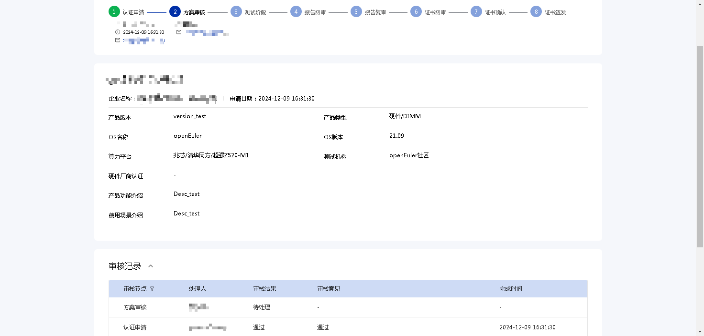
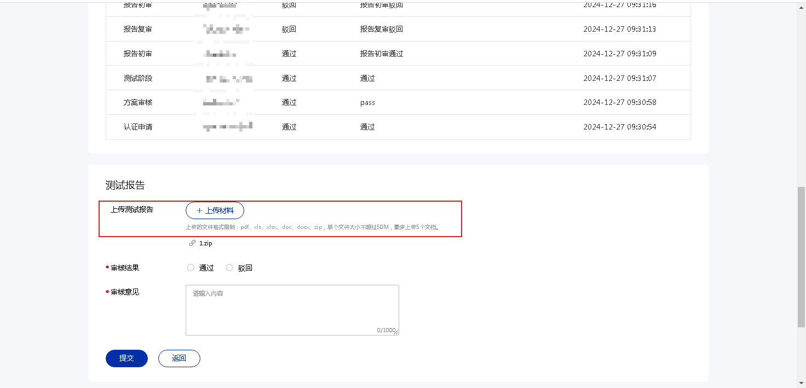
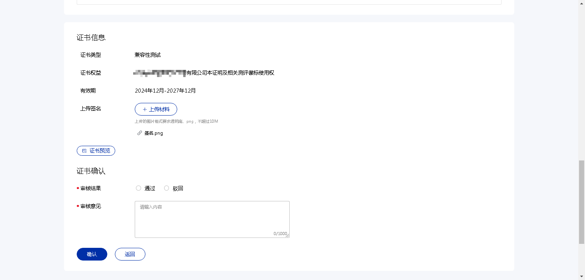

# 欧拉技术测评平台用户指南

## 介绍
欧拉技术测评平台（简称：测评平台）地址为：[https://certification.openeuler.org](https://certification.openeuler.org)，用于承载OSV/IHV/ISV合作伙伴的欧拉技术测评流程，包括伙伴账号注册和技术测评两个大模块。本指南主要介绍测评平台具体操作。

## 账号注册与企业认证流程
流程如下：

以下是详细流程步骤：

- 步骤1：账号注册（已完成账号注册的可跳过该步骤）

  伙伴登录[技术测评平台](https://certification.openeuler.org)，完成账号注册：

  

  完善个人信息，点击页面右上角 “用户名（注册时填写的用户名）” -> “账号中心”

  

  

  点击修改，进入编辑界面，完善邮箱信息

  > 建议填写企业邮箱，邮箱后续和CLA邮箱关联。

  

- 步骤2：企业认证

  完善个人信息后，需进行企业认证，才能申请欧拉兼容性技术测评，在“个人中心”点击左下的“企业信息”，如下图

  

  点击“企业实名认证”进入提交页面，如下：

  

  需提交企业LOGO（透明底）、工商注册国家/地区、企业邮箱、上传营业执照。

  上传营业执照后，会自动从营业执照中提取信息，包括以下字段：

  > **注意**：
  >
  > 1. 自动提取有一定的失败率，提取后请再次确认。确认无误后，点击“提交”完成企业认证。系统会自动根据提交的信息，确认企业信息是否有效。
  > 2. 如企业信息验证不通过，请检查企业名称是否带有中文括号，如有，请切换为英文括号后重试。
  
  

- 步骤3：签署CLA协议

  点击首页的“CLA签署”或者访问“[https://www.openeuler.org/zh/community/contribution/](https://www.openeuler.org/zh/community/contribution/)”，点击左下角的“openEuler社区贡献者许可协议”进入CLA签署页面

  

  有以下几个类型可以选择：

  

  如果作为企业的员工进行技术测评，建议在公司政策允许情况下，签署“员工CLA”。进入签署页面后，需填写Gitee账号（用于后续欧拉相关仓库相关活动）、邮箱账号（必须和测评平台的邮箱账号一致）、姓名

  

  至此，完成伙伴账号的注册和认证。

## 欧拉技术测评申请流程
伙伴申请欧拉兼容性技术测评流程如下：

前提：伙伴完成[账号注册与企业认证流程](#账号注册与企业认证流程)

- 步骤1：技术测评申请
  
  伙伴访问[技术测评平台](https://certification.openeuler.org)，点击“申请技术测评”

  
  
- 步骤2：填写方案信息
  
  根据提示，完善方案信息和测试环境信息：
  
  

  > **注意**：
  >
  > 1. 欧拉兼容性技术测评要求适配多算力平台，因此，此处的算力平台需**至少选择2个算力平台（OSV/IHV可以只选择1个）**。
  > 2. 为确保最终证书生成的效果，**算力平台选择最多不超过8个**，如您想体现多算力，请以“[xx算力平台]/其他/其他”方式进行概括选择。
  > 3. **测试机构选择任意创新中心**，如测评过程有任何问题可基于[支撑矩阵](https://gitee.com/openeuler/technical-certification/issues/I87HDL?from=project-issue)进行联系。
  
  完善提交后，会自动返回主页面，可以在“测评申请”列表查看到对应的方案
  
  
  
  点击方案，可以进入详情页查看方案详情和各个阶段的处理人。**默认方案审核在1个工作日内完成**（如未及时处理，请基于[支撑矩阵](https://gitee.com/openeuler/technical-certification/issues/I87HDL?from=project-issue)跟催），如果审核不通过，方案会驳回到提交人，此时提交人需查看驳回原因，修改后重新提交。
  
  
  
- 步骤3：执行测试

  根据[技术测评测试标准](README.md#测试标准)对方案进行测试，并提交测试报告：

  

  上传后，创新中心及社区负责人会对测试报告进行审核，通过审核后，即可进入证书签发的流程，社区负责人对证书信息进行初审，确认证书信息与实际测试内容一致后通过审核，由伙伴进行证书确认。

- 步骤4：证书确认

  通过社区的证书初审后，申请人需要进行证书确认，页面如下：

  

  申请人需要确认证书上软件的信息、测试环境信息等是否准确无误，确认准确无误后，需上传伙伴的签名/签章(透明底)，用于后续证书生成。申请人也可以点击“证书预览”，查看证书预览页面。

  > 上传签名/签章不是必须项，如您认为签名/签章信息敏感，可选择不上传，直接生成证书。

- 步骤5. 兼容性信息发布

  证书确认后，社区负责人将会进行最终的证书签发，签发后，兼容性信息会自动同步到欧拉社区[商业软件兼容性清单](https://www.openeuler.org/zh/compatibility/)。

